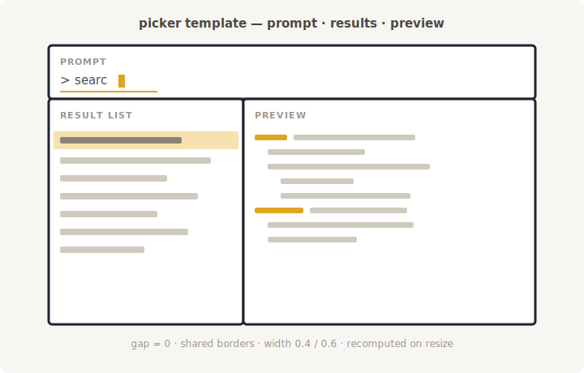
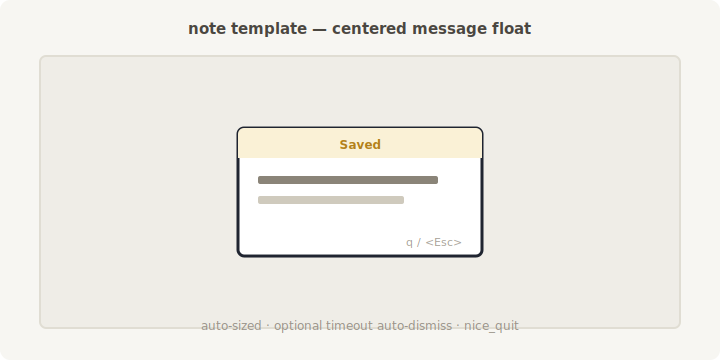
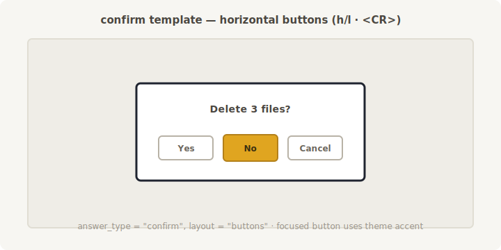
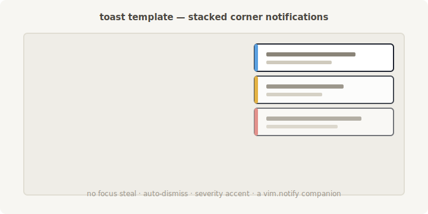

# Concept: `lib.nvim.ui.kit` — a themed, composable UI toolkit

> Status: **concept / design proposal** (no code yet). Working name `ui.kit` is
> a placeholder — see [Open decisions](#open-decisions).
> Everything specified here is **cross-platform** (pure `vim.api` / `vim.fn`
> float + highlight APIs, no shell-outs, no OS-specific paths).

## 1. Purpose

Building a Neovim plugin means re-solving the same UI problems over and over:

- floating windows with the same handful of options (overlay style, no
  numbers, `q`/`<Esc>` to close, centered, bordered, titled);
- short-lived popups that flash up and dismiss (notes, confirmations, prompts);
- **multi-window compositions** — a Telescope-like picker needs 3 windows
  (input · results · preview) of different sizes that must line up perfectly,
  share borders, and leave no gaps. Getting that geometry right by hand is
  fiddly and gets re-done in every plugin.

`ui.kit` is one module that provides:

1. a **theme / preset system** so a dev (or an end user) picks *one* look and
   every popup, hover, select and prompt is visually coordinated;
2. a **composition engine** that lays out several aligned windows from a
   declarative spec;
3. a **component library** (note, toast, prompt, input, select, menu, confirm,
   …) built on those two foundations.

The goal: pick a preset → build any UI from it; or, with no preset, choose
colors/borders/highlights yourself through a documented option surface.

## 2. Design principles

- **Reuse the existing primitives, don't replace them.** `ui.kit` sits *on top*
  of [`lib.nvim.window.make_scratch`](../../lua/lib/nvim/window/make_scratch.lua),
  [`nice_quit`](../../lua/lib/nvim/window/nice_quit.lua),
  [`set_title`](../../lua/lib/nvim/window/set_title.lua),
  [`center`](../../lua/lib/nvim/window/center.lua),
  [`close_on_focus_lost`](../../lua/lib/nvim/window/close_on_focus_lost.lua)
  and [`lib.nvim.ui.hl`](../../lua/lib/nvim/ui/hl/init.lua). These stay the
  single source of truth for "one float".
- **Layered, each layer usable alone.** A dev who only wants a themed float
  uses the surface layer; someone building a picker uses the layout layer; most
  callers just call a component.
- **Config follows the repo pattern.** A `config/` + `DEFAULTS.lua` split like
  [`lib.config`](../../lua/lib/config/init.lua) holds the default theme and any
  user-registered presets. Option validation reuses
  [`lib.nvim.normalize.validators`](../../lua/lib/nvim/normalize/validators.lua)
  (`to_enum`, `to_int`, `to_string`, …).
- **Colorscheme-friendly by default.** Every theme highlight *links* to a
  standard group (`NormalFloat`, `FloatBorder`, `FloatTitle`, `Pmenu`,
  `PmenuSel`, `Visual`, …) unless the user overrides it, so the default look is
  correct in any colorscheme — the same fallback strategy hover_select already
  uses in [`highlight.lua`](../../lua/lib/nvim/ui/hover_select/highlight.lua).
- **Handles, not globals.** Components return a small handle object with
  methods (`:close()`, `:set_lines()`, `:focus()`, …), following the
  `window.attach` fluent-wrapper pattern in
  [`window/init.lua`](../../lua/lib/nvim/window/init.lua). No module-level
  mutable window state shared across callers.

## 3. Where it lives

```
lib.nvim.window.*   ← low-level, ONE window (primitives) — unchanged
lib.nvim.ui.hl      ← idempotent highlight/namespace helper — reused
lib.nvim.ui.hover_select  ← existing chooser — kept, later delegates to kit
lib.nvim.ui.kit.*   ← NEW: themed, composable toolkit
```

Rationale: `lib.nvim.ui.*` already hosts the *interactive/visual* layer
(hover_select, hl); `lib.nvim.window.*` holds the *single-window primitives*
`kit` builds on. So primitives stay in `window`, the themed component kit lives
in `ui`. (The task sketch called it `nvim.window.popup`; this proposal keeps
low-level float code in `window` and puts the themed components in
`ui.kit.popup` instead.)

## 4. Architecture — four layers

```
┌─────────────────────────────────────────────────────────────┐
│ D. Components   note · toast · prompt · input · select ·      │
│                 menu · progress · confirm · picker-scaffold   │
├─────────────────────────────────────────────────────────────┤
│ C. Layout       declarative multi-window geometry             │
│                 (aligned regions, shared borders, on-resize)  │
├─────────────────────────────────────────────────────────────┤
│ B. Surface      one themed float + lifecycle handle           │
│                 (wraps window.make_scratch + theme)           │
├─────────────────────────────────────────────────────────────┤
│ A. Theme        design tokens + presets + user overrides      │
│                 (colors, borders, padding, zindex, dims)      │
└─────────────────────────────────────────────────────────────┘
        ↑ reuses: window.*, ui.hl, notify, normalize, lib.config-style setup
```

Each layer only depends on the ones below it.

## 5. Layer A — Theme & preset system (the core innovation)

A **theme** is a plain table of design tokens. Nothing is hardcoded in
components; they read tokens.

```lua
---@class Lib.UI.Kit.Theme
---@field border      "none"|"single"|"double"|"rounded"|"solid"|"shadow"|string[]  # nvim_open_win border
---@field ascii_border boolean          # force ASCII border chars (terminals w/o good Unicode)
---@field padding     integer|{ x:integer, y:integer }
---@field zindex      { base:integer, popup:integer, toast:integer, menu:integer }
---@field title_pos   "left"|"center"|"right"
---@field dims        { min_w:integer, max_w:integer, min_h:integer, max_h:integer }
---@field hl          Lib.UI.Kit.ThemeHighlights   # semantic highlight groups (see below)

---@class Lib.UI.Kit.ThemeHighlights
---@field normal    string|Lib.Highlight.Opts   # body            (default: link NormalFloat)
---@field border    string|Lib.Highlight.Opts   # border          (default: link FloatBorder)
---@field title     string|Lib.Highlight.Opts   # title           (default: link FloatTitle)
---@field selection string|Lib.Highlight.Opts   # current item    (default: link PmenuSel)
---@field accent    string|Lib.Highlight.Opts   # focused button / active
---@field muted     string|Lib.Highlight.Opts   # hints, secondary text
---@field error     string|Lib.Highlight.Opts   # error / destructive
```

**Presets** are named themes shipped with the module — they differ in border
strength and colors, exactly as requested. Built-ins, e.g.:

| Preset      | Border    | Feel                                  |
| ----------- | --------- | ------------------------------------- |
| `"minimal"` | `none`    | borderless, blends into the editor    |
| `"rounded"` | `rounded` | default; soft, colorscheme-linked     |
| `"solid"`   | `single`  | crisp box                             |
| `"double"`  | `double`  | heavy/emphatic                        |
| `"ascii"`   | ASCII     | for terminals without good Unicode    |

**Resolution.** A caller may pass, anywhere a theme is accepted:
- a preset **name** (`theme = "double"`),
- a **partial override** table (deep-merged over the active default), or
- a full custom table.

```lua
local kit = require("lib.nvim.ui.kit")

-- pick a preset for one call:
kit.popup({ type = "note", theme = "double", title = "Hi", message = "…" })

-- override just the accent on top of the default preset:
kit.popup({ type = "note", theme = { hl = { accent = { fg = "#89b4fa", bold = true } } } })
```

**User theming / registering presets** — a `setup()` following the
`lib.config` pattern ([config/init.lua](../../lua/lib/config/init.lua) +
[DEFAULTS.lua](../../lua/lib/config/DEFAULTS.lua)):

```lua
require("lib.nvim.ui.kit").setup({
  default = "rounded",             -- active preset when none is passed
  presets = {                      -- user-defined named presets
    myproject = {
      border  = "double",
      padding = { x = 2, y = 1 },
      hl = { accent = { fg = "#f5c2e7" }, selection = "Visual" },
    },
  },
})
-- later, anywhere:  kit.popup({ ..., theme = "myproject" })
```

Highlight groups are materialized **idempotently** through
[`lib.nvim.ui.hl`](../../lua/lib/nvim/ui/hl/init.lua) (`hl.set(group, opts, ns)`
+ `hl.namespace(name)`), re-applied on `ColorScheme` so links survive a theme
switch. A theme is applied to a window via `winhighlight`
(`NormalFloat:KitNormal,FloatBorder:KitBorder,…`), the same mechanism
hover_select uses today.

## 6. Layer B — Surface primitive

A **surface** is one themed float + a lifecycle handle. It is a thin wrapper
that hands geometry/buffer creation to
[`make_scratch`](../../lua/lib/nvim/window/make_scratch.lua) and then applies
the resolved theme.

```lua
---@param opts Lib.UI.Kit.SurfaceOpts   # lines, theme, title, dims, relative/row/col, nice_quit, enter, on_close…
---@return Lib.UI.Kit.Surface|nil
local surface = kit.surface.open(opts)

surface:set_lines(lines)     -- replace content (respects modifiable lock)
surface:set_title(str)       -- -> window.set_title
surface:focus()              -- enter the window
surface:on_close(fn)         -- lifecycle hook
surface:close()              -- idempotent close + buffer wipe
surface.winid, surface.bufnr -- raw handles when needed
```

Reused wiring: `nice_quit` for `q`/`<Esc>`, `close_on_focus_lost` for
auto-dismiss on focus loss, `center` for centering. The surface adds only
theme application + the handle object; it does **not** re-implement float
creation.

## 7. Layer C — Layout / composition engine

This is what makes multi-window UIs (pickers) easy. A **layout spec** is a
declarative tree of regions; the engine computes concrete geometry for every
named slot, aligned with **zero gaps / shared borders**, clamped to the editor,
and recomputed on `VimResized`.

```lua
-- Telescope-like picker: input on top, results left, preview right.
local layout = kit.layout.compute({
  width = 0.8, height = 0.8, relative = "editor",   -- outer box (fraction of editor)
  gap = 0,                                           -- shared borders, no gaps
  rows = {
    { name = "input",  height = 3 },                 -- fixed 3 rows
    { cols = {                                       -- remaining height, split into cols
        { name = "results", width = 0.4 },           -- 40%
        { name = "preview", width = 0.6 },           -- 60%
    }},
  },
})
-- layout.slots.input / .results / .preview  →  { row, col, width, height, relative }
```

Sizing vocabulary per region: a **fraction** (`0.4` of the parent axis), a
**fixed** integer (`height = 3`), or `nil` (take the remainder), with optional
`min`/`max`. The engine returns a `slots` table of `nvim_open_win`-ready
geometry that callers feed to `kit.surface.open` — so the three windows align
by construction. A `kit.layout.mount(spec, render)` convenience opens all
surfaces, wires a shared `close`/resize handler, and returns a group handle.

This layer is pure geometry math (no I/O), hence trivially unit-testable — and
it is the direct answer to the "3 aligned windows are hard" pain point.

### 7a. Layout templates (ready-made arrangements)

Nobody should hand-write the picker spec above every time. `kit.layout` ships a
registry of **named templates**: each is a finished window arrangement (a
sketch below) *plus* the ready layout spec, so you either mount it as-is or
tweak it. Every template is **usable and modifiable** — override a slot's
size, swap what fills a slot, or start from the template and edit the spec.

```lua
-- Mount a template as-is:
local picker = kit.layout.template("picker", {
  theme  = "rounded",
  prompt = "picker",              -- see prompt behavior below
  on_change = function(query) … end,   -- fired as the user types
  on_submit = function(item) … end,    -- <CR> on the selected result
})
picker.slots.results:set_lines(matches)   -- fill slots yourself
picker.slots.preview:set_lines(preview_lines)

-- …or take the template's spec and modify it:
local spec = kit.layout.templates.picker.spec
spec.rows[1].height = 1                    -- a slimmer prompt
spec.rows[2].cols[1].width = 0.5           -- 50/50 split
local custom = kit.layout.mount(spec, render)
```

**Sketches → templates.** Sketches live in
[`assets/ui-kit/`](assets/ui-kit/) and are the design reference for each
template (they can be replaced by real screenshots once the components exist).

**`picker`** — prompt (full width, top) · result list (bottom-left, 0.4) ·
preview (bottom-right, 0.6). Matches the hand sketch that motivated this
section.



**`note`** — a single centered message float.



**`confirm`** — message + horizontal buttons (the Phase-4 button component).



**`toast`** — stacked, auto-dismissing corner notifications.



**Prompt behavior in a template.** A template slot named `prompt` can be
mounted in two modes (your choice per call):

- `prompt = "picker"` (default for the picker template) — the prompt slot is an
  **interactive picker prompt**: an insert-mode input that debounces keystrokes
  and calls `on_change(query)` to drive the result list, with `<CR>` →
  `on_submit(selected)`, `<C-n>`/`<C-p>` (and arrows) moving the selection in
  the results slot, `<Esc>` closing the group. This is what makes the template
  behave like a Telescope prompt out of the box.
- `prompt = "plain"` — the prompt slot is just a themed `surface`; the caller
  wires its buffer/keymaps however they like. Use this when the template's
  built-in prompt behavior is not what you want.

So the same template serves both "give me a working picker prompt" and "give me
three aligned windows, I'll drive the top one myself".

## 8. Layer D — Components

`kit.popup(opts)` is the friendly front door; it dispatches on `opts.type`.
Every component is themed, cross-platform, and returns a handle or fires a
callback.

```lua
-- note: title + message, auto-sized, q/<Esc> to close, optional auto-dismiss
kit.popup({ type = "note", title = "Saved", message = "Wrote 3 files", timeout = 2000 })

-- select: a list chooser (delegates to hover_select in Phase 1; native later)
kit.popup({
  type = "select",
  message = "Pick one",
  selection = { "yes", "no", "maybe" },
  on_select = function(choice, idx) … end,
})

-- prompt: ask, answer either confirm (yes/no) or free text
kit.popup({ type = "prompt", question = "Delete file?", answer_type = "confirm",
            on_answer = function(yes) … end })
kit.popup({ type = "prompt", question = "New name:", answer_type = "text",
            on_answer = function(text) … end })
```

Proposed component set (the task asked "are there more sensible ones?" — yes):

| Component  | `type`       | What it is                                             | Reuses / notes |
| ---------- | ------------ | ------------------------------------------------------ | -------------- |
| Note       | `"note"`     | title + message float, optional `timeout` auto-close   | surface + nice_quit |
| Toast      | `"toast"`    | ephemeral corner message, stackable, auto-dismiss      | surface, no focus steal — a `vim.notify`-style companion |
| Prompt     | `"prompt"`   | question → `confirm` (yes/no) or `text`                | surface (+ confirm layer for buttons) |
| Input      | `"input"`    | single-line input, `vim.ui.input` replacement          | surface, insert-mode buffer |
| Select     | `"select"`   | vertical list chooser (single/multi)                   | Phase 1: delegates to `ui.hover_select`; later native |
| Menu       | `"menu"`     | action list at cursor (label → callback)               | surface + select nav |
| Progress   | `"progress"` | spinner / progress surface for async ops               | surface + timer, `:set_progress()` |
| Confirm    | `"confirm"`  | yes/no with **horizontal buttons** (see §9)            | confirm layer — highest effort |
| Picker     | —            | composed input+results+preview scaffold                | layout engine showcase (`kit.picker`) |

`kit.picker` is not a full fuzzy finder — it is the **scaffold** (three aligned
themed surfaces + shared lifecycle from Layer C) that a plugin fills with its
own matching/preview logic. It demonstrates the whole stack working together.

## 9. The button-confirm component (phased, highest effort) — ✅ shipped

> **Implemented** as `lib.nvim.ui.kit.confirm` (`kit.confirm` / `prompt` with
> `layout = "buttons"`). The design below is what was built.

The "cherry on top": a confirm dialog whose options are **horizontal buttons**
reachable with `h`/`l`/arrows, `<CR>` to confirm, `<Esc>` to cancel.

```
   ┌──────────────────────────────────────┐
   │  Delete 3 files?                      │
   │                                       │
   │        [ Yes ]   « No »   [ Cancel ]  │   ← « » = focused button
   └──────────────────────────────────────┘
```

It slots into the existing API as a prompt variant so callers opt in without a
new entry point:

```lua
kit.popup({ type = "prompt", question = "Delete 3 files?",
            answer_type = "confirm", layout = "buttons",   -- "list" (default) | "buttons"
            choices = { "Yes", "No", "Cancel" },
            on_answer = function(choice) … end })
```

Why it is the expensive piece (and therefore **phased last**): it needs its own
button-row layout math (measure labels, center, space evenly), per-button focus
highlighting via extmarks, a dedicated horizontal-navigation keymap set
(distinct from the vertical `j`/`k` chooser), theming hooks (`accent` for the
focused button), and its own tests. Everything else in this concept is
comparatively cheap; this one component is a mini-project. It is fully designed
here so it can be built in a focused pass (in this repo or a dedicated
`lib.nvim` session) and then adopted by e.g. filetree.nvim through a
`confirmations.type = "list" | "buttons"` switch.

## 10. hover_select absorption plan

**Clear end goal:** `hover_select` is fully absorbed into `ui.kit` — its
functionality becomes the kit's native `select` chooser, and the standalone
module survives only as a thin, API-compatible shim (or is retired once every
call site has moved). It is used ~10× across the author's plugins, so the path
is deliberately non-breaking: the public API (`open`/`close`/`is_open`,
`Lib.HoverSelect.Options`) keeps working at every step.

The absorption runs alongside the phased roadmap (§13):

| Step | When | What happens | hover_select call sites |
| ---- | ---- | ------------ | ----------------------- |
| **1. Delegate** ✅ | Phase 1–2 | `kit.popup({ type = "select" })` called the existing `ui.hover_select` under the hood. | untouched |
| **2. Native chooser** ✅ | Phase 3 | Built `lib.nvim.ui.kit.chooser` (themed, superset of `Lib.HoverSelect.Options`), matching hover_select's navigation (`j`/`k`/arrows, `<CR>`, `<Esc>`/`q`, `h`/`l` blocked) and multi-select. `kit.select` now uses it; the delegation is gone. | untouched |
| **3. Shim** ✅ | Phase 3 | `ui.hover_select` is now a thin adapter over `kit.chooser`: `open(opts)` maps `Lib.HoverSelect.Options` → the chooser and returns `(bufnr, winid)`; `close`/`is_open` delegate. Same signature/behavior; the `buffer`/`window`/`navigation`/`highlight`/`config` submodules were deleted (logic lives in the kit). | still work, unchanged API |
| **4. Migrate & (optionally) retire** 🔨 | now | Call sites moved to `kit.select`: **markdown.nvim, pdfport.nvim, pickers.nvim** done (pushed); **filetree.nvim** migrated + tested (127/127) but its commit is pending a held git lock. Once all are in and confirmed, the shim can be removed. | markdown/pdfport/pickers ✅, filetree ⏳ |

Design implication for the native chooser (Phase 3): it must be a **superset**
of `Lib.HoverSelect.Options` so the Step-3 shim is a pure mapping with no
feature gaps — single + multi select, custom `on_select(items, indices)`,
cursor-relative or explicit positioning, and the same key handling. That
constraint is baked into the chooser's design from the start.

The absorption is entirely **internal**: no consumer of `lib.nvim.ui.hover_select`
sees a behavior change at any step; the only externally visible addition is the
new, richer `kit.popup({ type = "select" })` entry point.

## 11. Cross-platform notes

- All rendering is `nvim_open_win` + `nvim_set_hl` + `winhighlight` — already
  platform-independent; nothing shells out.
- The **one** genuine cross-platform UI concern is border glyphs: some
  terminals render Unicode box-drawing poorly. Handled by a theme token
  (`ascii_border` / the `"ascii"` preset) rather than per-call branching.
- No filesystem or path assumptions in this module; where a component shows a
  path (e.g. picker preview header) it goes through
  [`lib.nvim.fs.path_shorten`](../../lua/lib/nvim/fs/path_shorten/init.lua) /
  `lib.nvim.normalize`.

## 12. Registration & documentation plan

Per the task's explicit requirement, every new feature is wired into the three
surfaces the library already uses:

1. **Module layout** — `lua/lib/nvim/ui/kit/` with `init.lua` per submodule and
   `@types/` folders (repo convention: one dir = one module, types out of
   source). Likely: `kit/init.lua`, `kit/theme/`, `kit/surface/`, `kit/layout/`,
   `kit/components/{note,toast,prompt,input,select,menu,progress,confirm}/`,
   `kit/config/` + `kit/config/DEFAULTS.lua`.
2. **Aggregator** — add keys to all three strategies so `require("lib").kit`
   resolves: `MODULE_MAP` in
   [strategies/metatable.lua](../../lua/lib/strategies/metatable.lua), plus
   [lazy.lua](../../lua/lib/strategies/lazy.lua) and
   [eager.lua](../../lua/lib/strategies/eager.lua) (e.g. `kit = "lib.nvim.ui.kit"`).
3. **`@types/all_functions.lua`** — add
   [`---@field kit Lib.UI.Kit`](../../lua/lib/@types/all_functions.lua) (and any
   flat convenience exports) so `require("lib").kit` gets full LSP types.
4. **Vimdoc** — a new section in
   [doc/lib.nvim.txt](../../doc/lib.nvim.txt) (e.g. under Namespaces →
   `*lib.nvim-ui.kit*`) plus a dedicated `doc/lib.nvim-kit.txt` tagged
   `*lib.nvim-kit*` (and per-component tags), following the two-tier docs
   convention in `*lib.nvim-conventions*`. Per-module `README.md` next to the
   source for the detailed reference.
5. **Health** — extend [lib/health.lua](../../lua/lib/health.lua)'s `PROBE`
   list with a representative `kit` module so `:checkhealth lib` covers it.

## 13. Phased roadmap

> Status: **Phases 1–4 shipped — the roadmap is complete.** Theme engine,
> surface, and every component (`note`/`toast`/`input`/`select`/`prompt`/
> `picker`/`confirm`/`menu`/`progress`), the layout engine + `picker` template,
> and hover_select absorbed to a shim. `menu` is a cursor-anchored action list;
> `progress` passes through to the dedicated `lib.nvim.progress`. Only follow-up:
> migrate the ~10 hover_select call sites to `kit.select` (§10 step 4).

| Phase | Deliverable | Notes |
| ----- | ----------- | ----- |
| **1** ✅ | Theme/preset engine (Layer A) + surface primitive (Layer B) + `setup()` | Foundation; ships built-in presets; `note` as first component |
| **2** ✅ | Short-lived popups: `toast`, `prompt(confirm/text)`, `input`; `select` delegating to hover_select | The high-frequency, quick-win components |
| **3** ✅ | Layout engine (Layer C) + templates (§7a) + native `select` chooser + hover_select shim + interactive `kit.picker` | Composition + absorption + Telescope-style picker |
| **4** ✅ | Button-confirm (§9) — horizontal buttons, h/l navigation, `KitSelection` focus; routed via `kit.confirm` and `prompt(answer_type="confirm", layout="buttons")` | The highest-effort component |
| **4** | `confirm` with horizontal buttons (§9); hover_select shim + call-site migration | Highest-effort component last; API-stable migration |

## 14. Open decisions

1. **Namespace / name.** Recommendation: `lib.nvim.ui.kit` — short, honest
   ("a kit of coordinated UI pieces"), sits cleanly beside `ui.hl` /
   `ui.hover_select`. Alternatives, by flavor:
   - *toolkit-ish:* `ui.kit` ✅, `ui.studio`, `ui.forge`
   - *surface/overlay-ish:* `ui.surface`, `ui.overlay`, `ui.canvas`
   - *composition-ish:* `ui.deck`, `ui.compose`, `ui.stage`
   Rejected: the original sketch's `window.popup` (mixes low-level float code
   with themed components — primitives stay in `lib.nvim.window`). *Pick before
   Phase 1;* the whole doc uses `ui.kit` as the working name.
2. **Native select — decided.** Delegate to hover_select in Phase 1, build the
   native chooser in Phase 3, then absorb hover_select behind a shim (full plan
   in §10). Clear end goal: hover_select's functionality lives in `ui.kit`; the
   standalone module becomes a compatibility shim and is retired once call sites
   have moved.
3. **Toast stacking scope.** A corner-toast manager needs a tiny bit of
   module-level state (the stack of active toasts). Recommendation: allow it,
   confined to the toast submodule, exposed via getters — consistent with the
   "no *shared* global window state" principle (each *component* may own its own
   internal registry).
4. **Button-confirm here or separate session.** Fully designed in §9;
   recommendation is to build it as the final phase in this repo so the whole
   toolkit is coherent — but it is self-contained enough to split into its own
   focused session if desired, then dropped into filetree.nvim via a
   `confirmations.type` switch.
