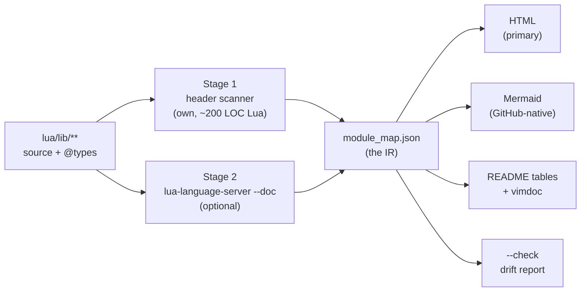

# Module map — generated hierarchy & API documentation

> **Status:** concept, not implemented. Written in response to the question
> "can we get something Doxygen-like out of the annotations we already have?"
>
> Short answer: yes, and cheaper than expected — the annotation coverage needed
> for it is already at 100%, and the hard part (parsing the API surface) can be
> delegated to `lua-language-server`, which is already installed and already
> emits exactly the JSON we would otherwise have to write a parser for.

## Goal

A **living map** of `lib.nvim` — every namespace, every module, its one-line
purpose, its public API, and a link to its `README.md` — generated from the
actual Lua tree rather than hand-maintained, and regenerated whenever a module
is added.

Concretely, three properties, in priority order:

1. **Never stale.** A map that has to be updated by hand is wrong within a
   week. Generation must be one command, and staleness must be *detectable*
   (see [Drift detection](#drift-detection-the-part-that-earns-its-keep)).
2. **Navigable.** Click a module, see what it does, jump to its README and its
   source. Hierarchy visible at a glance.
3. **Committed to the repo.** Self-contained, no build step for the reader,
   works from a `file://` URL and on GitHub Pages.

## What carries over from Doxygen, and what does not

Doxygen works because C++ headers carry a machine-readable declaration of the
public surface, and its structured comments (`@brief`, `@param`, …) attach
prose to those declarations. The pipeline is: parse → symbol graph → render.

LuaCATS annotations (`---@class`, `---@field`, `---@param`, `---@module`) are
the direct analogue, and this repo already uses them densely:

| Tag        | Count (source) | Count (`@types`) |
|------------|----------------|------------------|
| `@field`   | 1367           | 1356             |
| `@param`   | 996            | —                |
| `@return`  | 712            | —                |
| `@module`  | 337            | 111              |
| `@class`   | 253            | 249              |
| `@alias`   | 43             | 43               |

What does **not** carry over is Doxygen's ambition. Doxygen renders call
graphs, inheritance diagrams, per-function pages, cross-referenced source
listings. Most of that is either meaningless for a Lua utility library (no
inheritance to speak of) or a large parser project (call graphs need real
name resolution). The 20% worth building is: **hierarchy + module purpose +
public API surface + links**. That is what this concept covers.

## Inventory — what we are starting from

Measured against the current tree:

| Fact | Value |
|------|-------|
| Lua source files (excluding `@types`) | 226 |
| `@types` files | 111 |
| Files **with** `---@module` | **226 / 226 (100%)** |
| Files with a prose block after `---@module` | 189 / 226 (84%) |
| Directories containing `init.lua` ("modules") | 120 |
| Modules with a `README.md` | 51 / 120 (43%) |
| Directories with a `@types/` subdirectory | 80 |
| Nesting depth | 1–6, concentrated at 3–4 |

Two things stand out:

- **`---@module` coverage is already perfect.** That is the single most
  important precondition, and it is met. A filesystem walk keyed on `@module`
  is reliable *today*, with no annotation campaign needed first.
- **The prose gap is small and known.** 37 files have a bare `@module` line
  with no description. Those are the only files that need touching, and the
  generator can list them (see [Drift detection](#drift-detection-the-part-that-earns-its-keep)).

There is also **no build tooling in the repo at all** — no `Makefile`, no
`package.json`, no `scripts/`, only `.stylua.toml`. That is a constraint worth
respecting: whatever gets built should not be the thing that introduces a
Node or Python toolchain.

## Architecture

Three stages, with a serialized intermediate representation between stage 2
and stage 3. The IR is the load-bearing design decision: it decouples "what do
we know about the tree" from "how do we draw it", so a new renderer never
touches the scanner.



### Stage 1 — header scanner (own code, required)

Walks `lua/lib`, and for each `.lua` file reads **only the leading comment
block** — everything from line 1 up to the first non-comment line. It extracts:

- the `---@module 'lib.nvim.fs.mkdirp'` path
- the prose block following it (first sentence → summary, rest → description)
- whether a sibling `README.md` exists
- whether a sibling `@types/` exists
- the export shape: `return function` vs `return M` vs table literal

Parsing Lua properly is a project. Parsing a *leading comment block* is a
20-line loop, and it is reliable precisely because `@module` coverage is 100%
and the convention is uniform. This stage has **zero dependencies** — it runs
in `nvim --headless` against the repo itself.

Hierarchy comes from the filesystem, not from the annotations: a directory
with `init.lua` is a module, its subdirectories are children. The `@module`
path is used to *verify* that, not to derive it — a mismatch between the
declared `@module` path and the file's actual location is itself a finding.

### Stage 2 — LuaLS export (optional, for API detail)

`lua-language-server` ships a `--doc` mode that emits `doc.json`. **I verified
this works on this repo** — running it against `lua/lib/nvim/fs` produced 232
entries in ~1.5 MB of JSON, including, for example:

```
Lib.Fs.FindRoot.Opts  (type)   defined at find_root/@types/init.lua:4
  desc:  "Options for the cached marker-based root finder."
  field: markers      string[]?   "Marker names … `*`/`?` globs allowed …"
  field: cache_chain  boolean?    "Cache the root for every directory passed …"
  field: capacity     integer?    "LRU cache capacity … 512 when `cache_chain` …"
```

That is the entire `@class`/`@field`/`@alias` surface, with descriptions, file
paths and line numbers, already structured — no parser to write and no parser
to maintain against future LuaCATS syntax.

**Important limitation, measured:** `--doc` captures *declared types*, not
module-level prose. A module that ends in `return function(path) … end` has no
named symbol for LuaLS to hang the `---@module` header on, so that prose does
**not** appear in `doc.json`. This is exactly why Stage 1 is not optional and
Stage 2 is: the two sources are complementary, not redundant.

| Source | Gives us | Needed? |
|--------|----------|---------|
| Header scanner | hierarchy, module purpose, README links, export shape | **required** |
| LuaLS `--doc` | classes, fields, aliases, signatures, types | optional enrichment |

Consequence for the design: the map degrades gracefully. Without
`lua-language-server` on `PATH` you get the full hierarchy and every module
description, just no expandable API tables. The generator should detect its
absence and say so in the output, not fail.

### Stage 3 — renderers

All read `module_map.json` and nothing else.

## Output formats — and a recommendation

The request mentioned "image/pdf/website". These are not equally good fits,
and I would push back on two of them:

| Format | Verdict | Why |
|--------|---------|-----|
| **Self-contained HTML** | **recommended primary** | Interactive (collapse/expand, filter, search), clickable README + source links, diffable as text, no reader-side build, works from `file://` and GitHub Pages. |
| **Mermaid in Markdown** | **recommended secondary** | GitHub renders it natively in the repo — the map is visible without leaving the code host. Good for the top-two-levels overview; unreadable past ~40 nodes, so scope it to namespaces. |
| Generated Markdown tables | **recommended** | Feeds the existing `README.md` module tables and `doc/lib.nvim.txt` namespace list, which are hand-maintained today and therefore already drifting. |
| PDF | **advise against** | Binary-ish blob in git, no interactivity, needs a renderer toolchain (the exact dependency the repo currently avoids), and goes stale invisibly. Nothing it offers is better than "print the HTML". |
| PNG/SVG image | **advise against as primary** | Same staleness problem, no links, unreadable at 120 modules. An SVG *inside* the HTML is fine; an image as the deliverable is not. |

The HTML should be a **single file**, inlined CSS/JS, no CDN — same
constraint the repo already lives under (a Neovim plugin cannot assume network
access, and a doc artifact that breaks offline is a bad artifact). Suggested
location: `docs/map/index.html`, with `docs/map/module_map.json` committed
alongside it so the IR is reviewable in diffs.

### What the HTML should actually show

- **Tree pane** — collapsible, one row per module, `lib.nvim.fs.mkdirp` style
  paths, badges for `README` / `@types` / `exported via lib.*`.
- **Detail pane** — the module's prose, its public API table from Stage 2, and
  three links: `README.md`, `init.lua`, `@types/init.lua`.
- **Filter box** — substring match over module path + summary. At 120 modules
  this matters more than any diagram.
- **Namespace overview** — the Mermaid graph, top two levels only.

## The annotation contract

The generator can only surface what the files declare. Rather than inventing a
new tag vocabulary, **standardize on the convention 84% of the repo already
follows**:

```lua
---@module 'lib.nvim.fs.mkdirp'
--- Recursive directory creation (`mkdir -p`) built purely on libuv.
---
--- Why this exists next to `vim.fn.mkdir(path, "p")`: …
```

- Line 1: `---@module '<full.dotted.path>'` — already universal.
- Line 2: **one sentence**, the summary. This is what lands in the tree view
  and in the generated README tables, so it should read as a noun phrase, not
  "This module does…".
- Remaining lines: free prose, rendered in the detail pane.

**On inventing `@map.category` / `@map.status` tags:** tempting, but LuaLS
warns on unknown annotation tags under some diagnostic configurations, which
would trade a clean editor experience for map metadata. Two existing tags
(`@brief` ×8, `@description` ×10) already show what happens when a second
convention appears — it stays at 8 files and confuses the picture. Recommend
**not** adding new tags in phase 1; derive category from the directory
(`lua/lib/lua/**` = pure Lua, `lua/lib/nvim/**` = Neovim adapters) and revisit
only if that proves insufficient.

## Drift detection — the part that earns its keep

A pretty map is nice. **A map that fails the build when reality diverges from
documentation is the actual product.** Once the IR exists, these checks are
nearly free, and each one corresponds to a real defect class already observed
in this repo:

| Check | Real instance |
|-------|---------------|
| Type declares a symbol the aggregator does not export | **Happened.** `find_root` was declared as `---@field find_root` on the `Lib` class in `@types/all_functions.lua` but was wired into *none* of the three strategies — `lib.find_root` was `nil`. The type lied for an unknown length of time and was found by accident. |
| Module has no `README.md` | 69 of 120 modules. Not all need one, but the list should be a deliberate choice, not an accident. |
| Module has no prose after `---@module` | 37 files. |
| `@module` path ≠ actual file location | Catches copy-paste module headers. |
| `README.md` links to a path that does not exist | The README module tables are hand-maintained and already contain deep relative links. |
| Module exists on disk but appears in no namespace `init.lua` | Catches a module that was written but never wired up. |
| `doc/lib.nvim.txt` namespace list ≠ actual namespaces | The vimdoc table is hand-maintained today. |

`--check` exits non-zero with a report. That is what a hook or CI runs.

## Triggering

Three entry points, layered:

1. **`:LibMap`** — user command, regenerates everything. The repo already has
   a usercmd builder (`lua/lib/nvim/usercmd`) to hang this on, and
   `lua/lib/health.lua` is the natural place to surface "map is N commits
   stale".
2. **`nvim --headless -l scripts/gen_map.lua [--check]`** — the CLI form.
   Same code path, no Neovim UI. This is what hooks and CI call.
3. **Pre-commit hook → `--check`, not regenerate.**

That third point is a deliberate recommendation. A hook that *regenerates and
stages* output produces surprise diffs in commits the author did not intend to
touch, and interacts badly with `--amend` and rebases (this session's rebase
would have rewritten the artifact five times). A hook that *checks* and fails
with "module map is stale — run `:LibMap`" keeps regeneration explicit and the
diff intentional. Cost is one extra command when adding a module; benefit is
never wondering why a commit contains 400 lines of generated HTML.

CI runs the same `--check` so the hook cannot be silently skipped.

## Implementation phases

Each phase is independently useful and independently shippable.

**Phase 1 — scanner + IR + drift check.** No rendering at all. Produces
`module_map.json` and `--check`. This is the phase with the highest value per
line of code: it immediately finds the `find_root`-class bugs, and everything
later builds on its output. Estimated ~250 LOC of Lua.

**Phase 2 — HTML renderer.** Single self-contained file, tree + detail +
filter. Reads only the IR. ~400 LOC including inlined CSS/JS.

**Phase 3 — LuaLS enrichment.** Shell out to `lua-language-server --doc`, merge
`doc.json` into the IR, populate the API tables. Gated on the binary being
present. Verified feasible above.

**Phase 4 — feed the hand-maintained docs.** Generate the `README.md` module
tables and the `doc/lib.nvim.txt` namespace list from the IR, replacing the
hand-editing that happens today (and that this session did by hand, twice).

**Phase 5 — trigger integration.** `:LibMap`, pre-commit `--check`, CI.

Phases 1 and 5 could be swapped forward if the drift check alone is wanted in
CI quickly.

## Open questions

1. **Where does the artifact live?** `docs/map/` keeps it near the other docs;
   a `gh-pages` branch keeps generated output out of `main`'s history entirely.
   The latter is cleaner for diffs but adds a publishing step. Leaning
   `docs/map/` for phase 2, revisit if the HTML churns noisily.
2. **Does `lib.vim.*` belong on the map?** It mirrors `lib.nvim.*` with
   deliberate not-implemented stubs. Showing it doubles the tree; hiding it
   makes the parity status invisible. Possibly a toggle, with `doc/vim-parity.md`
   as the real home for that view.
3. **Are `@types/` files nodes or attributes?** Recommend attributes — a
   module's types belong *to* the module, not beside it. But that discards the
   distinction between a module with one `@types/init.lua` and one with six
   split type files.
4. **Granularity floor.** 120 `init.lua` modules is the natural unit, but
   there are 226 source files — helper files like
   `find_upward_dir/matcher.lua` are real, documented, and currently invisible
   at module granularity. Show them as leaf children, or fold them into the
   parent's detail pane?

## Non-goals

- Per-function reference pages. LuaLS already gives that in-editor, which is
  where it is actually wanted.
- Call graphs / dependency graphs between modules. Real value, but needs name
  resolution across `require` calls — a materially larger project. Worth
  revisiting once the IR exists, since `require(...)` string literals in the
  header-scanned region would get most of the way there.
- Replacing `doc/*.txt`. Vimdoc stays hand-written for the modules that
  deserve narrative documentation; only the mechanical namespace tables get
  generated.
