# lib.nvim — module map

> **Generated** by `lib.nvim.docmap`. Do not edit by hand — run `:LibMap`
> (or `nvim --headless -l scripts/gen_map.lua`) to regenerate.

**125 modules** · 24 namespaces · 120 helper files

The [interactive map](index.html) has filtering, full descriptions and
source links; this page is the version the code host renders directly.

## Namespaces

```mermaid
flowchart LR
  nlua_lib["lib.nvim"]
  nlua_lib_config["configbr/smallUser-facing configuration for lib.nvim./small"]
  nlua_lib_lua["luabr/smallNamespace-Aggregator für die…/small"]
  nlua_lib_lua_diff["diffbr/smallAggregated export for line-diff helpers:…/small"]
  nlua_lib_lua_dump["dumpbr/smallRecursive Lua value dumper, pure Lua — an…/small"]
  nlua_lib_lua_error["errorbr/smallStructured-error + safe-call-with-traceback…/small"]
  nlua_lib_lua_functions["functions"]
  nlua_lib_lua_json["json"]
  nlua_lib_lua_lazy["lazybr/smallProvides reusable helpers for safe and…/small"]
  nlua_lib_lua_memo["memobr/smallAggregated export for cache helpers with…/small"]
  nlua_lib_lua_numeral["numeralbr/smallAggregated export for numeral conversion…/small"]
  nlua_lib_lua_strings["strings"]
  nlua_lib_lua_tables["tablesbr/smallAggregated export for table helpers./small"]
  nlua_lib_lua_time["time"]
  nlua_lib_lua_uuid["uuidbr/smallUUIDv4 generation and formatting helpers,…/small"]
  nlua_lib_lua_yaml["yamlbr/smallDeliberately minimal, dependency-free…/small"]
  nlua_lib_nvim["nvimbr/smallNamespace-Aggregator für die…/small"]
  nlua_lib_nvim_autocmd["autocmdbr/small============================================…/small"]
  nlua_lib_nvim_buf_win_tab["buf_win_tab"]
  nlua_lib_nvim_buffer["buffer"]
  nlua_lib_nvim_cache["cachebr/smallCaching namespace: a persistent JSON disk…/small"]
  nlua_lib_nvim_core["core"]
  nlua_lib_nvim_cross["crossbr/smallCross-platform utilities for Neovim/Lua…/small"]
  nlua_lib_nvim_debounce["debouncebr/smallGeneric debounce primitive for callbacks./small"]
  nlua_lib_nvim_docmap["docmapbr/smallGenerated module map: scans an annotated…/small"]
  nlua_lib_nvim_dotrepeat["dotrepeatbr/smallWire native Vim `.`-repeat through the…/small"]
  nlua_lib_nvim_fs["fs"]
  nlua_lib_nvim_git["gitbr/smallGit utility helpers for Neovim./small"]
  nlua_lib_nvim_harvest["harvestbr/smallBuilding blocks for 'collect something from…/small"]
  nlua_lib_nvim_logger["loggerbr/smallStructured logging, diagnostics and crash…/small"]
  nlua_lib_nvim_lua_ls["lua_ls"]
  nlua_lib_nvim_map["mapbr/small============================================…/small"]
  nlua_lib_nvim_neotree["neotree"]
  nlua_lib_nvim_net["net"]
  nlua_lib_nvim_normalize["normalizebr/smallA small, dependency-free normalization…/small"]
  nlua_lib_nvim_notify["notifybr/smallAllows per-module prefix configuration…/small"]
  nlua_lib_nvim_progress["progressbr/smallCross-platform progress indicator,…/small"]
  nlua_lib_nvim_require["requirebr/smallSafe and extended require utilities/small"]
  nlua_lib_nvim_safe_api["safe_apibr/smallValidated, pcall-wrapped `vim.api`…/small"]
  nlua_lib_nvim_selection["selectionbr/smallReselect a Visual-mode line/char range…/small"]
  nlua_lib_nvim_system["systembr/smallHost-environment namespace: OS/shell/path…/small"]
  nlua_lib_nvim_terminal["terminalbr/smallTerminal helper functions/small"]
  nlua_lib_nvim_token["tokenbr/smallEphemeral session-nonce / token generator,…/small"]
  nlua_lib_nvim_treesitter["treesitter"]
  nlua_lib_nvim_ui["ui"]
  nlua_lib_nvim_usercmd["usercmdbr/small============================================…/small"]
  nlua_lib_nvim_window["windowbr/smallWindow-control helpers for overlay /…/small"]
  nlua_lib_nvim_usrcmds["nvim_usrcmdsbr/smallUtility user commands that don't belong in…/small"]
  nlua_lib_strategies["strategies"]
  nlua_lib_vim["vimbr/smallNamespace-Aggregator für die Spiegelung…/small"]
  nlua_lib_vim_autocmd["autocmdbr/smallClassic-Vim-Spiegelung von…/small"]
  nlua_lib_vim_buf_win_tab["buf_win_tabbr/smallClassic-Vim-Spiegelung von…/small"]
  nlua_lib_vim_buffer["bufferbr/smallClassic-Vim-Spiegelung von…/small"]
  nlua_lib_vim_core["corebr/smallClassic-Vim-Spiegelung von `lib.nvim.core`./small"]
  nlua_lib_vim_cross["crossbr/smallClassic-Vim-Spiegelung von `lib.nvim.cross`./small"]
  nlua_lib_vim_fs["fsbr/smallClassic-Vim-Spiegelung von `lib.nvim.fs`./small"]
  nlua_lib_vim_git["gitbr/smallClassic-Vim-Spiegelung von `lib.nvim.git`./small"]
  nlua_lib_vim_lua_ls["lua_lsbr/smallClassic-Vim-Spiegelung von…/small"]
  nlua_lib_vim_map["mapbr/smallClassic-Vim-Spiegelung von `lib.nvim.map`./small"]
  nlua_lib_vim_normalize["normalizebr/smallClassic-Vim-Spiegelung von…/small"]
  nlua_lib_vim_notify["notifybr/smallClassic-Vim-Spiegelung von…/small"]
  nlua_lib_vim_require["requirebr/smallClassic-Vim-Spiegelung von…/small"]
  nlua_lib_vim_terminal["terminalbr/smallClassic-Vim-Spiegelung von…/small"]
  nlua_lib_vim_ui["uibr/smallClassic-Vim-Spiegelung von `lib.nvim.ui`./small"]
  nlua_lib_vim_usercmd["usercmdbr/smallClassic-Vim-Spiegelung von…/small"]
  nlua_lib_vim_window["windowbr/smallClassic-Vim-Spiegelung von…/small"]
  nlua_lib --> nlua_lib_config
  nlua_lib --> nlua_lib_lua
  nlua_lib_lua --> nlua_lib_lua_diff
  nlua_lib_lua --> nlua_lib_lua_dump
  nlua_lib_lua --> nlua_lib_lua_error
  nlua_lib_lua --> nlua_lib_lua_functions
  nlua_lib_lua --> nlua_lib_lua_json
  nlua_lib_lua --> nlua_lib_lua_lazy
  nlua_lib_lua --> nlua_lib_lua_memo
  nlua_lib_lua --> nlua_lib_lua_numeral
  nlua_lib_lua --> nlua_lib_lua_strings
  nlua_lib_lua --> nlua_lib_lua_tables
  nlua_lib_lua --> nlua_lib_lua_time
  nlua_lib_lua --> nlua_lib_lua_uuid
  nlua_lib_lua --> nlua_lib_lua_yaml
  nlua_lib --> nlua_lib_nvim
  nlua_lib_nvim --> nlua_lib_nvim_autocmd
  nlua_lib_nvim --> nlua_lib_nvim_buf_win_tab
  nlua_lib_nvim --> nlua_lib_nvim_buffer
  nlua_lib_nvim --> nlua_lib_nvim_cache
  nlua_lib_nvim --> nlua_lib_nvim_core
  nlua_lib_nvim --> nlua_lib_nvim_cross
  nlua_lib_nvim --> nlua_lib_nvim_debounce
  nlua_lib_nvim --> nlua_lib_nvim_docmap
  nlua_lib_nvim --> nlua_lib_nvim_dotrepeat
  nlua_lib_nvim --> nlua_lib_nvim_fs
  nlua_lib_nvim --> nlua_lib_nvim_git
  nlua_lib_nvim --> nlua_lib_nvim_harvest
  nlua_lib_nvim --> nlua_lib_nvim_logger
  nlua_lib_nvim --> nlua_lib_nvim_lua_ls
  nlua_lib_nvim --> nlua_lib_nvim_map
  nlua_lib_nvim --> nlua_lib_nvim_neotree
  nlua_lib_nvim --> nlua_lib_nvim_net
  nlua_lib_nvim --> nlua_lib_nvim_normalize
  nlua_lib_nvim --> nlua_lib_nvim_notify
  nlua_lib_nvim --> nlua_lib_nvim_progress
  nlua_lib_nvim --> nlua_lib_nvim_require
  nlua_lib_nvim --> nlua_lib_nvim_safe_api
  nlua_lib_nvim --> nlua_lib_nvim_selection
  nlua_lib_nvim --> nlua_lib_nvim_system
  nlua_lib_nvim --> nlua_lib_nvim_terminal
  nlua_lib_nvim --> nlua_lib_nvim_token
  nlua_lib_nvim --> nlua_lib_nvim_treesitter
  nlua_lib_nvim --> nlua_lib_nvim_ui
  nlua_lib_nvim --> nlua_lib_nvim_usercmd
  nlua_lib_nvim --> nlua_lib_nvim_window
  nlua_lib --> nlua_lib_nvim_usrcmds
  nlua_lib --> nlua_lib_strategies
  nlua_lib --> nlua_lib_vim
  nlua_lib_vim --> nlua_lib_vim_autocmd
  nlua_lib_vim --> nlua_lib_vim_buf_win_tab
  nlua_lib_vim --> nlua_lib_vim_buffer
  nlua_lib_vim --> nlua_lib_vim_core
  nlua_lib_vim --> nlua_lib_vim_cross
  nlua_lib_vim --> nlua_lib_vim_fs
  nlua_lib_vim --> nlua_lib_vim_git
  nlua_lib_vim --> nlua_lib_vim_lua_ls
  nlua_lib_vim --> nlua_lib_vim_map
  nlua_lib_vim --> nlua_lib_vim_normalize
  nlua_lib_vim --> nlua_lib_vim_notify
  nlua_lib_vim --> nlua_lib_vim_require
  nlua_lib_vim --> nlua_lib_vim_terminal
  nlua_lib_vim --> nlua_lib_vim_ui
  nlua_lib_vim --> nlua_lib_vim_usercmd
  nlua_lib_vim --> nlua_lib_vim_window
```

## Modules

| Module | Description | Docs |
|---|---|---|
| `lib.config` | User-facing configuration for lib.nvim. | [src](../../lua/lib/config/init.lua) |
| `lib.lua` | Namespace-Aggregator für die editorunabhängigen Lua-Helfer. | [src](../../lua/lib/lua/init.lua) |
| &nbsp;&nbsp;`lib.lua.diff` | Aggregated export for line-diff helpers: `lines` (cheap splice-region diff) and `myers` (full DP LCS-based edit script). | [README](../../lua/lib/lua/diff/README.md) · [src](../../lua/lib/lua/diff/init.lua) |
| &nbsp;&nbsp;`lib.lua.dump` | Recursive Lua value dumper, pure Lua — an alternative/complement to `vim.inspect` for tables/metatables/functions/threads/userdata, with a hard… | [README](../../lua/lib/lua/dump/README.md) · [src](../../lua/lib/lua/dump/init.lua) |
| &nbsp;&nbsp;`lib.lua.error` | Structured-error + safe-call-with-traceback convention, pure Lua. | [README](../../lua/lib/lua/error/README.md) · [src](../../lua/lib/lua/error/init.lua) |
| &nbsp;&nbsp;`lib.lua.functions` |  | [src](../../lua/lib/lua/functions/init.lua) |
| &nbsp;&nbsp;`lib.lua.json` |  | [src](../../lua/lib/lua/json/init.lua) |
| &nbsp;&nbsp;&nbsp;&nbsp;`lib.lua.json.decode` | Decode namespace marker. | [src](../../lua/lib/lua/json/decode/init.lua) |
| &nbsp;&nbsp;&nbsp;&nbsp;`lib.lua.json.encode` | Pure-Lua JSON encoder — the counterpart to `lib.lua.json.decode`. | [src](../../lua/lib/lua/json/encode/init.lua) |
| &nbsp;&nbsp;`lib.lua.lazy` | Provides reusable helpers for safe and explicit lazy-loading of Lua modules in Neovim. | [README](../../lua/lib/lua/lazy/README.md) · [src](../../lua/lib/lua/lazy/init.lua) |
| &nbsp;&nbsp;`lib.lua.memo` | Aggregated export for cache helpers with enhanced API. | [README](../../lua/lib/lua/memo/README.md) · [src](../../lua/lib/lua/memo/init.lua) |
| &nbsp;&nbsp;`lib.lua.numeral` | Aggregated export for numeral conversion helpers: `roman` and `alpha`. | [README](../../lua/lib/lua/numeral/README.md) · [src](../../lua/lib/lua/numeral/init.lua) |
| &nbsp;&nbsp;`lib.lua.strings` |  | [src](../../lua/lib/lua/strings/init.lua) |
| &nbsp;&nbsp;&nbsp;&nbsp;`convert` |  |  |
| &nbsp;&nbsp;&nbsp;&nbsp;`lib.lua.strings.transform` | Aggregated string transformation helpers. | [src](../../lua/lib/lua/strings/transform/init.lua) |
| &nbsp;&nbsp;`lib.lua.tables` | Aggregated export for table helpers. | [src](../../lua/lib/lua/tables/init.lua) |
| &nbsp;&nbsp;`time` |  |  |
| &nbsp;&nbsp;&nbsp;&nbsp;`lib.lua.time.diff` | Provides a lightweight, reusable timer object for measuring elapsed time between code sections. | [README](../../lua/lib/lua/time/diff/README.md) · [src](../../lua/lib/lua/time/diff/init.lua) |
| &nbsp;&nbsp;&nbsp;&nbsp;&nbsp;&nbsp;`internal` |  |  |
| &nbsp;&nbsp;&nbsp;&nbsp;`lib.lua.time.format` | Format a unix timestamp using a small set of named style presets, pure Lua (`os.date`), no `vim.*`. | [README](../../lua/lib/lua/time/format/README.md) · [src](../../lua/lib/lua/time/format/init.lua) |
| &nbsp;&nbsp;&nbsp;&nbsp;`lib.lua.time.presets` | Date-range preset resolver, pure Lua (`os.time`/`os.date`), no `vim.*`. | [README](../../lua/lib/lua/time/presets/README.md) · [src](../../lua/lib/lua/time/presets/init.lua) |
| &nbsp;&nbsp;`lib.lua.uuid` | UUIDv4 generation and formatting helpers, pure Lua (no `vim.*`). | [README](../../lua/lib/lua/uuid/README.md) · [src](../../lua/lib/lua/uuid/init.lua) |
| &nbsp;&nbsp;`lib.lua.yaml` | Deliberately minimal, dependency-free YAML-ish decoder, pure Lua. | [README](../../lua/lib/lua/yaml/README.md) · [src](../../lua/lib/lua/yaml/init.lua) |
| `lib.nvim` | Namespace-Aggregator für die Neovim-spezifischen Helfer. | [src](../../lua/lib/nvim/init.lua) |
| &nbsp;&nbsp;`lib.nvim.autocmd` | ========================================================= Autocommand helper utilities. | [src](../../lua/lib/nvim/autocmd/init.lua) |
| &nbsp;&nbsp;`buf_win_tab` |  |  |
| &nbsp;&nbsp;&nbsp;&nbsp;`lib.nvim.buf_win_tab.capture` | Deterministic capture of buffers and windows created by Ex commands. | [README](../../lua/lib/nvim/buf_win_tab/capture/README.md) · [src](../../lua/lib/nvim/buf_win_tab/capture/init.lua) |
| &nbsp;&nbsp;&nbsp;&nbsp;`lib.nvim.buf_win_tab.get_option` | Read a buffer option across a wide range of Neovim versions. | [README](../../lua/lib/nvim/buf_win_tab/get_option/README.md) · [src](../../lua/lib/nvim/buf_win_tab/get_option/init.lua) |
| &nbsp;&nbsp;&nbsp;&nbsp;`lib.nvim.buf_win_tab.move_buffer_to_tab` | Moves the current buffer into a new tab and removes it from the original tab | [src](../../lua/lib/nvim/buf_win_tab/move_buffer_to_tab/init.lua) |
| &nbsp;&nbsp;&nbsp;&nbsp;`lib.nvim.buf_win_tab.normal_buffer` | Shared buffer/window primitives around "normal" file buffers. | [src](../../lua/lib/nvim/buf_win_tab/normal_buffer/init.lua) |
| &nbsp;&nbsp;&nbsp;&nbsp;`lib.nvim.buf_win_tab.resize_guarded` | Guarded resize helper that allows window resize shortcuts in normal editors while preserving keypresses in terminals and special plugin buffers. | [README](../../lua/lib/nvim/buf_win_tab/resize_guarded/README.md) · [src](../../lua/lib/nvim/buf_win_tab/resize_guarded/init.lua) |
| &nbsp;&nbsp;&nbsp;&nbsp;`lib.nvim.buf_win_tab.safe_adjacent_buffer` | Helper to force-save the last usable file buffer via :w! | [src](../../lua/lib/nvim/buf_win_tab/safe_adjacent_buffer/init.lua) |
| &nbsp;&nbsp;&nbsp;&nbsp;`lib.nvim.buf_win_tab.selection` | Read the visual selection, whether or not visual mode is still active. | [README](../../lua/lib/nvim/buf_win_tab/selection/README.md) · [src](../../lua/lib/nvim/buf_win_tab/selection/init.lua) |
| &nbsp;&nbsp;&nbsp;&nbsp;`lib.nvim.buf_win_tab.word_under_cursor` | Extract the word under the cursor using a configurable word-character pattern, and report its byte span. | [README](../../lua/lib/nvim/buf_win_tab/word_under_cursor/README.md) · [src](../../lua/lib/nvim/buf_win_tab/word_under_cursor/init.lua) |
| &nbsp;&nbsp;`buffer` |  |  |
| &nbsp;&nbsp;&nbsp;&nbsp;`lib.nvim.buffer.context` | Buffer-metadata accessor cached by `changedtick`. | [README](../../lua/lib/nvim/buffer/context/README.md) · [src](../../lua/lib/nvim/buffer/context/init.lua) |
| &nbsp;&nbsp;`lib.nvim.cache` | Caching namespace: a persistent JSON disk cache and a generic in-memory TTL/changedtick namespace cache for event handlers. | [README](../../lua/lib/nvim/cache/README.md) · [src](../../lua/lib/nvim/cache/init.lua) |
| &nbsp;&nbsp;`lib.nvim.core` |  | [src](../../lua/lib/nvim/core/init.lua) |
| &nbsp;&nbsp;`lib.nvim.cross` | Cross-platform utilities for Neovim/Lua Provides platform detection, path normalization, and shell helpers | [src](../../lua/lib/nvim/cross/init.lua) |
| &nbsp;&nbsp;&nbsp;&nbsp;`lib.nvim.cross.copy_to_clipboard` | Cross-platform clipboard write. | [src](../../lua/lib/nvim/cross/copy_to_clipboard/init.lua) |
| &nbsp;&nbsp;&nbsp;&nbsp;`lib.nvim.cross.executable` | Executable lookup helpers: PATH resolution and Mason-managed binaries. | [src](../../lua/lib/nvim/cross/executable/init.lua) |
| &nbsp;&nbsp;&nbsp;&nbsp;`fs` |  |  |
| &nbsp;&nbsp;&nbsp;&nbsp;&nbsp;&nbsp;`lib.nvim.cross.fs._cwd` | Resolve the current working directory via libuv, compatible across NVIM versions. | [src](../../lua/lib/nvim/cross/fs/_cwd/init.lua) |
| &nbsp;&nbsp;&nbsp;&nbsp;&nbsp;&nbsp;`lib.nvim.cross.fs.expand_path` | Expand `~`, `$VAR` (POSIX) and `%VAR%` (Windows) references in a raw path string. | [src](../../lua/lib/nvim/cross/fs/expand_path/init.lua) |
| &nbsp;&nbsp;&nbsp;&nbsp;&nbsp;&nbsp;`lib.nvim.cross.fs.mutate` | Injection-safe file mutation primitives, built directly on libuv (no shell involved) — safe to use with untrusted/user-controlled paths. | [README](../../lua/lib/nvim/cross/fs/mutate/README.md) · [src](../../lua/lib/nvim/cross/fs/mutate/init.lua) |
| &nbsp;&nbsp;&nbsp;&nbsp;&nbsp;&nbsp;`separators` |  | [README](../../lua/lib/nvim/cross/fs/separators/README.md) |
| &nbsp;&nbsp;&nbsp;&nbsp;&nbsp;&nbsp;&nbsp;&nbsp;`lib.nvim.cross.fs.separators.collapse_dots` | Lexically collapse '.'/'..' segments and repeated separators in a path. | [src](../../lua/lib/nvim/cross/fs/separators/collapse_dots/init.lua) |
| &nbsp;&nbsp;&nbsp;&nbsp;&nbsp;&nbsp;&nbsp;&nbsp;`lib.nvim.cross.fs.separators.drive_upper` | Uppercase a Windows drive-letter prefix ("c:/foo" -> "C:/foo"). | [src](../../lua/lib/nvim/cross/fs/separators/drive_upper/init.lua) |
| &nbsp;&nbsp;&nbsp;&nbsp;&nbsp;&nbsp;&nbsp;&nbsp;`lib.nvim.cross.fs.separators.has_win_sep` |  | [src](../../lua/lib/nvim/cross/fs/separators/has_win_sep/init.lua) |
| &nbsp;&nbsp;&nbsp;&nbsp;&nbsp;&nbsp;&nbsp;&nbsp;`lib.nvim.cross.fs.separators.normalize` | Normalizes path separators for the current OS. | [src](../../lua/lib/nvim/cross/fs/separators/normalize/init.lua) |
| &nbsp;&nbsp;&nbsp;&nbsp;&nbsp;&nbsp;&nbsp;&nbsp;`lib.nvim.cross.fs.separators.unify_slashes` | Convert every backslash in `path` to a forward slash — a pure string transform: no expansion, no absolute-path resolution, no collapsing of repeated… | [src](../../lua/lib/nvim/cross/fs/separators/unify_slashes/init.lua) |
| &nbsp;&nbsp;&nbsp;&nbsp;`lib.nvim.cross.open_default` | Open a path or URL with the system's default application — the cross-platform equivalent of double-clicking it in a file manager (extension/URL-scheme… | [src](../../lua/lib/nvim/cross/open_default/init.lua) |
| &nbsp;&nbsp;&nbsp;&nbsp;`platform` |  |  |
| &nbsp;&nbsp;&nbsp;&nbsp;`lib.nvim.cross.run` | Shell selection and runners FIX: Optimize, doc | [src](../../lua/lib/nvim/cross/run/init.lua) |
| &nbsp;&nbsp;&nbsp;&nbsp;`lib.nvim.cross.run_argv` | Low-level argv-based process runner with stdin support. | [src](../../lua/lib/nvim/cross/run_argv/init.lua) |
| &nbsp;&nbsp;&nbsp;&nbsp;`uv` |  |  |
| &nbsp;&nbsp;&nbsp;&nbsp;&nbsp;&nbsp;`lib.nvim.cross.uv.fs` | Resolve the current working directory via libuv, compatible across NVIM versions. | [src](../../lua/lib/nvim/cross/uv/fs/init.lua) |
| &nbsp;&nbsp;&nbsp;&nbsp;&nbsp;&nbsp;`lib.nvim.cross.uv.spawn_capture` | Async spawn of an argv command with buffered stdout/stderr capture and an optional timeout. | [src](../../lua/lib/nvim/cross/uv/spawn_capture/init.lua) |
| &nbsp;&nbsp;&nbsp;&nbsp;&nbsp;&nbsp;`lib.nvim.cross.uv.spawn_stream` | Async spawn of an argv command with **line-by-line** streaming of stdout/stderr and an optional timeout. | [README](../../lua/lib/nvim/cross/uv/spawn_stream/README.md) · [src](../../lua/lib/nvim/cross/uv/spawn_stream/init.lua) |
| &nbsp;&nbsp;&nbsp;&nbsp;&nbsp;&nbsp;`lib.nvim.cross.uv.wait_until` | Poll a predicate on a libuv timer until it returns true or a maximum number of attempts is reached. | [src](../../lua/lib/nvim/cross/uv/wait_until/init.lua) |
| &nbsp;&nbsp;`lib.nvim.debounce` | Generic debounce primitive for callbacks. | [README](../../lua/lib/nvim/debounce/README.md) · [src](../../lua/lib/nvim/debounce/init.lua) |
| &nbsp;&nbsp;&nbsp;&nbsp;`lib.nvim.debounce.buffer` | Buffer-scoped debounce: one independent timer per `bufnr`. | [src](../../lua/lib/nvim/debounce/buffer/init.lua) |
| &nbsp;&nbsp;`lib.nvim.docmap` | Generated module map: scans an annotated Lua tree, builds an intermediate representation, checks it for documentation drift, and renders it. | [README](../../lua/lib/nvim/docmap/README.md) · [src](../../lua/lib/nvim/docmap/init.lua) |
| &nbsp;&nbsp;&nbsp;&nbsp;`render` |  |  |
| &nbsp;&nbsp;`lib.nvim.dotrepeat` | Wire native Vim `.`-repeat through the `operatorfunc` mechanism, without depending on `vim-repeat` or any other plugin. | [README](../../lua/lib/nvim/dotrepeat/README.md) · [src](../../lua/lib/nvim/dotrepeat/init.lua) |
| &nbsp;&nbsp;`fs` |  |  |
| &nbsp;&nbsp;&nbsp;&nbsp;`lib.nvim.fs.collect_recursive` | Recursive directory walker built on `fs_scandir`/`fs_scandir_next`. | [README](../../lua/lib/nvim/fs/collect_recursive/README.md) · [src](../../lua/lib/nvim/fs/collect_recursive/init.lua) |
| &nbsp;&nbsp;&nbsp;&nbsp;`lib.nvim.fs.create_entry` | Create a file or directory relative to a parent directory. | [README](../../lua/lib/nvim/fs/create_entry/README.md) · [src](../../lua/lib/nvim/fs/create_entry/init.lua) |
| &nbsp;&nbsp;&nbsp;&nbsp;`lib.nvim.fs.find_root` | Cached, marker-based project-root finder. | [README](../../lua/lib/nvim/fs/find_root/README.md) · [src](../../lua/lib/nvim/fs/find_root/init.lua) |
| &nbsp;&nbsp;&nbsp;&nbsp;`lib.nvim.fs.find_upward_dir` | Walk upward from `from` and return the nearest ancestor directory holding one of `names`. | [src](../../lua/lib/nvim/fs/find_upward_dir/init.lua) |
| &nbsp;&nbsp;&nbsp;&nbsp;`ignore` |  |  |
| &nbsp;&nbsp;&nbsp;&nbsp;&nbsp;&nbsp;`lib.nvim.fs.ignore.list` | Canonical filesystem ignore definitions for developer tooling. | [README](../../lua/lib/nvim/fs/ignore/list/README.md) · [src](../../lua/lib/nvim/fs/ignore/list/init.lua) |
| &nbsp;&nbsp;&nbsp;&nbsp;`lib.nvim.fs.is_dir` |  | [src](../../lua/lib/nvim/fs/is_dir/init.lua) |
| &nbsp;&nbsp;&nbsp;&nbsp;`lib.nvim.fs.is_readable_file` | Ensure the path is valid | [src](../../lua/lib/nvim/fs/is_readable_file/init.lua) |
| &nbsp;&nbsp;&nbsp;&nbsp;`lib.nvim.fs.is_subpath` | `vim.fs.normalize` always returns forward-slash paths (on every OS, including Windows) — so the separator used below must be "/" too. | [README](../../lua/lib/nvim/fs/is_subpath/README.md) · [src](../../lua/lib/nvim/fs/is_subpath/init.lua) |
| &nbsp;&nbsp;&nbsp;&nbsp;`lib.nvim.fs.is_valid_filename` | Validate a bare filename (not a full path) for filesystem safety. | [src](../../lua/lib/nvim/fs/is_valid_filename/init.lua) |
| &nbsp;&nbsp;&nbsp;&nbsp;`lib.nvim.fs.json` | Read/write JSON files, built on `lib.lua.json.encode` for encoding plus `lib.nvim.fs.read` and `lib.nvim.fs.write.to_file`. | [README](../../lua/lib/nvim/fs/json/README.md) · [src](../../lua/lib/nvim/fs/json/init.lua) |
| &nbsp;&nbsp;&nbsp;&nbsp;`lib.nvim.fs.mkdirp` | Recursive directory creation (`mkdir -p`) built purely on libuv. | [README](../../lua/lib/nvim/fs/mkdirp/README.md) · [src](../../lua/lib/nvim/fs/mkdirp/init.lua) |
| &nbsp;&nbsp;&nbsp;&nbsp;`lib.nvim.fs.normkey` | Canonical, cross-platform cache/dedup key for a filesystem path. | [README](../../lua/lib/nvim/fs/normkey/README.md) · [src](../../lua/lib/nvim/fs/normkey/init.lua) |
| &nbsp;&nbsp;&nbsp;&nbsp;`open` |  |  |
| &nbsp;&nbsp;&nbsp;&nbsp;&nbsp;&nbsp;`url` |  |  |
| &nbsp;&nbsp;&nbsp;&nbsp;&nbsp;&nbsp;&nbsp;&nbsp;`lib.nvim.fs.open.url.system_opener` | Open a path/URL with the OS default handler — the shared per-OS dispatch every plugin that shells out to `open`/`xdg-open`/`start` was reimplementing… | [README](../../lua/lib/nvim/fs/open/url/system_opener/README.md) · [src](../../lua/lib/nvim/fs/open/url/system_opener/init.lua) |
| &nbsp;&nbsp;&nbsp;&nbsp;`lib.nvim.fs.path` |  | [src](../../lua/lib/nvim/fs/path/init.lua) |
| &nbsp;&nbsp;&nbsp;&nbsp;`lib.nvim.fs.path_shorten` | Utility module to shorten file paths for display. | [src](../../lua/lib/nvim/fs/path_shorten/init.lua) |
| &nbsp;&nbsp;&nbsp;&nbsp;`lib.nvim.fs.polymorphic_rootresolver` | Generic polymorphic root-directory resolver for Neovim LSPs. | [README](../../lua/lib/nvim/fs/polymorphic_rootresolver/README.md) · [src](../../lua/lib/nvim/fs/polymorphic_rootresolver/init.lua) |
| &nbsp;&nbsp;&nbsp;&nbsp;`lib.nvim.fs.project_key` | Stable per-project cache key: prefers the Git root of `path` (default cwd), falls back to `path`/cwd itself, and runs the result through `lib.nvim.fs.normkey`… | [README](../../lua/lib/nvim/fs/project_key/README.md) · [src](../../lua/lib/nvim/fs/project_key/init.lua) |
| &nbsp;&nbsp;&nbsp;&nbsp;`lib.nvim.fs.read` | Read the whole contents of a file at `path` into a string. | [README](../../lua/lib/nvim/fs/read/README.md) · [src](../../lua/lib/nvim/fs/read/init.lua) |
| &nbsp;&nbsp;&nbsp;&nbsp;`lib.nvim.fs.relpath` | Compute `path` relative to `base`. | [src](../../lua/lib/nvim/fs/relpath/init.lua) |
| &nbsp;&nbsp;&nbsp;&nbsp;`lib.nvim.fs.scan_roots` | Scan multiple root directories for files (or dirs), with optional directory-name ignoring and an optional TTL-based on-disk cache. | [README](../../lua/lib/nvim/fs/scan_roots/README.md) · [src](../../lua/lib/nvim/fs/scan_roots/init.lua) |
| &nbsp;&nbsp;&nbsp;&nbsp;`lib.nvim.fs.trash` | Cross-platform "send to trash/recycle bin" (not a permanent delete). | [README](../../lua/lib/nvim/fs/trash/README.md) · [src](../../lua/lib/nvim/fs/trash/init.lua) |
| &nbsp;&nbsp;&nbsp;&nbsp;`write` |  |  |
| &nbsp;&nbsp;&nbsp;&nbsp;&nbsp;&nbsp;`lib.nvim.fs.write.append` | Append `content` to a file, creating parent directories as needed. | [src](../../lua/lib/nvim/fs/write/append/init.lua) |
| &nbsp;&nbsp;&nbsp;&nbsp;&nbsp;&nbsp;`lib.nvim.fs.write.async` | Asynchronous counterpart to `lib.nvim.fs.write.to_file`: creates the parent directory synchronously, then opens/writes/closes the file via libuv without… | [README](../../lua/lib/nvim/fs/write/async/README.md) · [src](../../lua/lib/nvim/fs/write/async/init.lua) |
| &nbsp;&nbsp;&nbsp;&nbsp;&nbsp;&nbsp;`lib.nvim.fs.write.batch` | Write many files asynchronously and invoke one callback when all of them have finished (success or failure). | [README](../../lua/lib/nvim/fs/write/batch/README.md) · [src](../../lua/lib/nvim/fs/write/batch/init.lua) |
| &nbsp;&nbsp;&nbsp;&nbsp;&nbsp;&nbsp;`lib.nvim.fs.write.to_file` |  | [src](../../lua/lib/nvim/fs/write/to_file/init.lua) |
| &nbsp;&nbsp;`lib.nvim.git` | Git utility helpers for Neovim. | [src](../../lua/lib/nvim/git/init.lua) |
| &nbsp;&nbsp;`lib.nvim.harvest` | Building blocks for "collect something from a scope, then show or export it" features. | [README](../../lua/lib/nvim/harvest/README.md) · [src](../../lua/lib/nvim/harvest/init.lua) |
| &nbsp;&nbsp;`lib.nvim.logger` | Structured logging, diagnostics and crash dumps for lib.nvim plugins. | [README](../../lua/lib/nvim/logger/README.md) · [src](../../lua/lib/nvim/logger/init.lua) |
| &nbsp;&nbsp;`lua_ls` |  |  |
| &nbsp;&nbsp;&nbsp;&nbsp;`lib.nvim.lua_ls.get_module_path` | Convert file path to Lua module path | [src](../../lua/lib/nvim/lua_ls/get_module_path/init.lua) |
| &nbsp;&nbsp;&nbsp;&nbsp;`insert` |  |  |
| &nbsp;&nbsp;&nbsp;&nbsp;&nbsp;&nbsp;`lib.nvim.lua_ls.insert.module_annnotation` | Insert a LuaLS @module annotation into a buffer at a configurable position | [README](../../lua/lib/nvim/lua_ls/insert/module_annnotation/README.md) · [src](../../lua/lib/nvim/lua_ls/insert/module_annnotation/init.lua) |
| &nbsp;&nbsp;`lib.nvim.map` | ========================================================= Keymap helper utilities. | [src](../../lua/lib/nvim/map/init.lua) |
| &nbsp;&nbsp;`neotree` |  |  |
| &nbsp;&nbsp;&nbsp;&nbsp;`lib.nvim.neotree.node` | Neo-tree node extraction utilities. | [src](../../lua/lib/nvim/neotree/node/init.lua) |
| &nbsp;&nbsp;`net` |  |  |
| &nbsp;&nbsp;&nbsp;&nbsp;`lib.nvim.net.curl` | Async (and blocking) HTTP-via-curl helper with JSON-body decoding. | [README](../../lua/lib/nvim/net/curl/README.md) · [src](../../lua/lib/nvim/net/curl/init.lua) |
| &nbsp;&nbsp;`lib.nvim.normalize` | A small, dependency-free normalization toolkit for plugin configs. | [src](../../lua/lib/nvim/normalize/init.lua) |
| &nbsp;&nbsp;`lib.nvim.notify` | Allows per-module prefix configuration while mirroring vim.notify semantics. | [README](../../lua/lib/nvim/notify/README.md) · [src](../../lua/lib/nvim/notify/init.lua) |
| &nbsp;&nbsp;&nbsp;&nbsp;`lib.nvim.notify.resolve_log_level` | Resolves a log level parameter to a valid vim.log.levels integer value. | [src](../../lua/lib/nvim/notify/resolve_log_level/init.lua) |
| &nbsp;&nbsp;&nbsp;&nbsp;`lib.nvim.notify.safe` | Provides helpers using vim.schedule, vim.defer_fn and vim.schedule_wrap to avoid calling vim.notify directly from contexts where it might cause issues (e.g.,… | [src](../../lua/lib/nvim/notify/safe/init.lua) |
| &nbsp;&nbsp;&nbsp;&nbsp;&nbsp;&nbsp;`docs` |  |  |
| &nbsp;&nbsp;`lib.nvim.progress` | Cross-platform progress indicator, decoupled from any single UI. | [README](../../lua/lib/nvim/progress/README.md) · [src](../../lua/lib/nvim/progress/init.lua) |
| &nbsp;&nbsp;&nbsp;&nbsp;`styles` |  |  |
| &nbsp;&nbsp;`lib.nvim.require` | Safe and extended require utilities | [src](../../lua/lib/nvim/require/init.lua) |
| &nbsp;&nbsp;`lib.nvim.safe_api` | Validated, pcall-wrapped `vim.api` accessors for buffers/windows. | [README](../../lua/lib/nvim/safe_api/README.md) · [src](../../lua/lib/nvim/safe_api/init.lua) |
| &nbsp;&nbsp;`lib.nvim.selection` | Reselect a Visual-mode line/char range after a mapping mutates the buffer. | [README](../../lua/lib/nvim/selection/README.md) · [src](../../lua/lib/nvim/selection/init.lua) |
| &nbsp;&nbsp;`lib.nvim.system` | Host-environment namespace: OS/shell/path snapshot plus the Windows RPC-pipe helper. | [README](../../lua/lib/nvim/system/README.md) · [src](../../lua/lib/nvim/system/init.lua) |
| &nbsp;&nbsp;`lib.nvim.terminal` | Terminal helper functions | [src](../../lua/lib/nvim/terminal/init.lua) |
| &nbsp;&nbsp;`lib.nvim.token` | Ephemeral session-nonce / token generator, for handshake IDs, temp-window IDs, correlation IDs, and similar internal bookkeeping. | [README](../../lua/lib/nvim/token/README.md) · [src](../../lua/lib/nvim/token/init.lua) |
| &nbsp;&nbsp;`treesitter` |  |  |
| &nbsp;&nbsp;&nbsp;&nbsp;`lib.nvim.treesitter.guard` | Filetype allowlist gate for treesitter-dependent features (highlighting, foldexpr, indentexpr). | [README](../../lua/lib/nvim/treesitter/guard/README.md) · [src](../../lua/lib/nvim/treesitter/guard/init.lua) |
| &nbsp;&nbsp;`ui` |  |  |
| &nbsp;&nbsp;&nbsp;&nbsp;`lib.nvim.ui.hl` | ========================================================= Highlight helper utilities. | [src](../../lua/lib/nvim/ui/hl/init.lua) |
| &nbsp;&nbsp;&nbsp;&nbsp;`lib.nvim.ui.kit` | Themed, composable UI toolkit for lib.nvim. | [README](../../lua/lib/nvim/ui/kit/README.md) · [src](../../lua/lib/nvim/ui/kit/init.lua) |
| &nbsp;&nbsp;`lib.nvim.usercmd` | ========================================================= User command helper utilities. | [src](../../lua/lib/nvim/usercmd/init.lua) |
| &nbsp;&nbsp;&nbsp;&nbsp;`lib.nvim.usercmd.composer` | Compose a route spec into ONE Neovim user command with subcommands, `<Tab>` completion, and Markdown docs — all read from the same tree. | [README](../../lua/lib/nvim/usercmd/composer/README.md) · [src](../../lua/lib/nvim/usercmd/composer/init.lua) |
| &nbsp;&nbsp;`lib.nvim.window` | Window-control helpers for overlay / floating windows. | [README](../../lua/lib/nvim/window/README.md) · [src](../../lua/lib/nvim/window/init.lua) |
| &nbsp;&nbsp;&nbsp;&nbsp;`lib.nvim.window.context` | Window-metadata accessor with a same-event cache. | [README](../../lua/lib/nvim/window/context/README.md) · [src](../../lua/lib/nvim/window/context/init.lua) |
| `lib.nvim_usrcmds` | Utility user commands that don't belong in a more specific plugin. | [src](../../lua/lib/nvim_usrcmds/init.lua) |
| `strategies` |  |  |
| `lib.vim` | Namespace-Aggregator für die Spiegelung nach klassischem Vim. | [src](../../lua/lib/vim/init.lua) |
| &nbsp;&nbsp;`lib.vim.autocmd` | Classic-Vim-Spiegelung von `lib.nvim.autocmd`. | [src](../../lua/lib/vim/autocmd/init.lua) |
| &nbsp;&nbsp;`lib.vim.buf_win_tab` | Classic-Vim-Spiegelung von `lib.nvim.buf_win_tab`. | [src](../../lua/lib/vim/buf_win_tab/init.lua) |
| &nbsp;&nbsp;`lib.vim.buffer` | Classic-Vim-Spiegelung von `lib.nvim.buffer`. | [src](../../lua/lib/vim/buffer/init.lua) |
| &nbsp;&nbsp;`lib.vim.core` | Classic-Vim-Spiegelung von `lib.nvim.core`. | [src](../../lua/lib/vim/core/init.lua) |
| &nbsp;&nbsp;`lib.vim.cross` | Classic-Vim-Spiegelung von `lib.nvim.cross`. | [src](../../lua/lib/vim/cross/init.lua) |
| &nbsp;&nbsp;`lib.vim.fs` | Classic-Vim-Spiegelung von `lib.nvim.fs`. | [src](../../lua/lib/vim/fs/init.lua) |
| &nbsp;&nbsp;`lib.vim.git` | Classic-Vim-Spiegelung von `lib.nvim.git`. | [src](../../lua/lib/vim/git/init.lua) |
| &nbsp;&nbsp;`lib.vim.lua_ls` | Classic-Vim-Spiegelung von `lib.nvim.lua_ls`. | [src](../../lua/lib/vim/lua_ls/init.lua) |
| &nbsp;&nbsp;`lib.vim.map` | Classic-Vim-Spiegelung von `lib.nvim.map`. | [src](../../lua/lib/vim/map/init.lua) |
| &nbsp;&nbsp;`lib.vim.normalize` | Classic-Vim-Spiegelung von `lib.nvim.normalize`. | [src](../../lua/lib/vim/normalize/init.lua) |
| &nbsp;&nbsp;`lib.vim.notify` | Classic-Vim-Spiegelung von `lib.nvim.notify`. | [src](../../lua/lib/vim/notify/init.lua) |
| &nbsp;&nbsp;`lib.vim.require` | Classic-Vim-Spiegelung von `lib.nvim.require`. | [src](../../lua/lib/vim/require/init.lua) |
| &nbsp;&nbsp;`lib.vim.terminal` | Classic-Vim-Spiegelung von `lib.nvim.terminal`. | [src](../../lua/lib/vim/terminal/init.lua) |
| &nbsp;&nbsp;`lib.vim.ui` | Classic-Vim-Spiegelung von `lib.nvim.ui`. | [src](../../lua/lib/vim/ui/init.lua) |
| &nbsp;&nbsp;`lib.vim.usercmd` | Classic-Vim-Spiegelung von `lib.nvim.usercmd`. | [src](../../lua/lib/vim/usercmd/init.lua) |
| &nbsp;&nbsp;`lib.vim.window` | Classic-Vim-Spiegelung von `lib.nvim.window`. | [src](../../lua/lib/vim/window/init.lua) |

## Drift

0 errors · 10 warnings · 127 info

| Severity | Check | Message |
|---|---|---|
| warn | `missing-summary` | lua/lib/lua/functions/init.lua has ---@module but no description line |
| warn | `missing-summary` | lua/lib/lua/json/init.lua has ---@module but no description line |
| warn | `missing-summary` | lua/lib/lua/strings/init.lua has ---@module but no description line |
| warn | `missing-summary` | lua/lib/nvim/core/init.lua has ---@module but no description line |
| warn | `missing-summary` | lua/lib/nvim/cross/fs/separators/has_win_sep/init.lua has ---@module but no description line |
| warn | `missing-summary` | lua/lib/nvim/fs/is_dir/init.lua has ---@module but no description line |
| warn | `missing-summary` | lua/lib/nvim/fs/path/init.lua has ---@module but no description line |
| warn | `missing-summary` | lua/lib/nvim/fs/write/to_file/init.lua has ---@module but no description line |
| warn | `missing-summary` | lua/lib/nvim/normalize/utils.lua has ---@module but no description line |
| warn | `missing-summary` | lua/lib/nvim/normalize/validators.lua has ---@module but no description line |

127 informational findings

| Check | Message |
|---|---|
| `missing-readme` | lua/lib has no README.md |
| `missing-readme` | lua/lib/config has no README.md |
| `missing-readme` | lua/lib/lua has no README.md |
| `missing-readme` | lua/lib/lua/functions has no README.md |
| `missing-readme` | lua/lib/lua/json has no README.md |
| `missing-readme` | lua/lib/lua/json/decode has no README.md |
| `missing-readme` | lua/lib/lua/json/encode has no README.md |
| `missing-readme` | lua/lib/lua/strings has no README.md |
| `missing-readme` | lua/lib/lua/strings/transform has no README.md |
| `missing-readme` | lua/lib/lua/tables has no README.md |
| `missing-readme` | lua/lib/nvim has no README.md |
| `missing-readme` | lua/lib/nvim/autocmd has no README.md |
| `missing-readme` | lua/lib/nvim/buf_win_tab/move_buffer_to_tab has no README.md |
| `missing-readme` | lua/lib/nvim/buf_win_tab/normal_buffer has no README.md |
| `missing-readme` | lua/lib/nvim/buf_win_tab/safe_adjacent_buffer has no README.md |
| `missing-readme` | lua/lib/nvim/core has no README.md |
| `missing-readme` | lua/lib/nvim/cross has no README.md |
| `missing-readme` | lua/lib/nvim/cross/copy_to_clipboard has no README.md |
| `missing-readme` | lua/lib/nvim/cross/executable has no README.md |
| `missing-readme` | lua/lib/nvim/cross/fs/_cwd has no README.md |
| `missing-readme` | lua/lib/nvim/cross/fs/expand_path has no README.md |
| `missing-readme` | lua/lib/nvim/cross/fs/separators/collapse_dots has no README.md |
| `missing-readme` | lua/lib/nvim/cross/fs/separators/drive_upper has no README.md |
| `missing-readme` | lua/lib/nvim/cross/fs/separators/has_win_sep has no README.md |
| `missing-readme` | lua/lib/nvim/cross/fs/separators/normalize has no README.md |
| `missing-readme` | lua/lib/nvim/cross/fs/separators/unify_slashes has no README.md |
| `missing-readme` | lua/lib/nvim/cross/open_default has no README.md |
| `missing-readme` | lua/lib/nvim/cross/run has no README.md |
| `missing-readme` | lua/lib/nvim/cross/run_argv has no README.md |
| `missing-readme` | lua/lib/nvim/cross/uv/fs has no README.md |
| `missing-readme` | lua/lib/nvim/cross/uv/spawn_capture has no README.md |
| `missing-readme` | lua/lib/nvim/cross/uv/wait_until has no README.md |
| `missing-readme` | lua/lib/nvim/debounce/buffer has no README.md |
| `missing-readme` | lua/lib/nvim/fs/find_upward_dir has no README.md |
| `missing-readme` | lua/lib/nvim/fs/is_dir has no README.md |
| `missing-readme` | lua/lib/nvim/fs/is_readable_file has no README.md |
| `missing-readme` | lua/lib/nvim/fs/is_valid_filename has no README.md |
| `missing-readme` | lua/lib/nvim/fs/path has no README.md |
| `missing-readme` | lua/lib/nvim/fs/path_shorten has no README.md |
| `missing-readme` | lua/lib/nvim/fs/relpath has no README.md |
| `missing-readme` | lua/lib/nvim/fs/write/append has no README.md |
| `missing-readme` | lua/lib/nvim/fs/write/to_file has no README.md |
| `missing-readme` | lua/lib/nvim/git has no README.md |
| `missing-readme` | lua/lib/nvim/lua_ls/get_module_path has no README.md |
| `missing-readme` | lua/lib/nvim/map has no README.md |
| `missing-readme` | lua/lib/nvim/neotree/node has no README.md |
| `missing-readme` | lua/lib/nvim/normalize has no README.md |
| `missing-readme` | lua/lib/nvim/notify/resolve_log_level has no README.md |
| `missing-readme` | lua/lib/nvim/notify/safe has no README.md |
| `missing-readme` | lua/lib/nvim/require has no README.md |
| `missing-readme` | lua/lib/nvim/terminal has no README.md |
| `missing-readme` | lua/lib/nvim/ui/hl has no README.md |
| `missing-readme` | lua/lib/nvim/usercmd has no README.md |
| `missing-readme` | lua/lib/nvim_usrcmds has no README.md |
| `missing-readme` | lua/lib/vim has no README.md |
| `missing-readme` | lua/lib/vim/autocmd has no README.md |
| `missing-readme` | lua/lib/vim/buf_win_tab has no README.md |
| `missing-readme` | lua/lib/vim/buffer has no README.md |
| `missing-readme` | lua/lib/vim/core has no README.md |
| `missing-readme` | lua/lib/vim/cross has no README.md |
| `missing-readme` | lua/lib/vim/fs has no README.md |
| `missing-readme` | lua/lib/vim/git has no README.md |
| `missing-readme` | lua/lib/vim/lua_ls has no README.md |
| `missing-readme` | lua/lib/vim/map has no README.md |
| `missing-readme` | lua/lib/vim/normalize has no README.md |
| `missing-readme` | lua/lib/vim/notify has no README.md |
| `missing-readme` | lua/lib/vim/require has no README.md |
| `missing-readme` | lua/lib/vim/terminal has no README.md |
| `missing-readme` | lua/lib/vim/ui has no README.md |
| `missing-readme` | lua/lib/vim/usercmd has no README.md |
| `missing-readme` | lua/lib/vim/window has no README.md |
| `unreferenced-module` | lib.health is required by no other file in the tree |
| `unreferenced-module` | lib.lua.diff is required by no other file in the tree |
| `unreferenced-module` | lib.lua.error is required by no other file in the tree |
| `unreferenced-module` | lib.lua.functions is required by no other file in the tree |
| `unreferenced-module` | lib.lua.json.decode is required by no other file in the tree |
| `unreferenced-module` | lib.lua.memo.memo is required by no other file in the tree |
| `unreferenced-module` | lib.lua.numeral is required by no other file in the tree |
| `unreferenced-module` | lib.lua.strings.transform is required by no other file in the tree |
| `unreferenced-module` | lib.lua.time.format is required by no other file in the tree |
| `unreferenced-module` | lib.lua.time.presets is required by no other file in the tree |
| `unreferenced-module` | lib.lua.uuid is required by no other file in the tree |
| `unreferenced-module` | lib.lua.yaml is required by no other file in the tree |
| `unreferenced-module` | lib.nvim.buf_win_tab.buffer_utils is required by no other file in the tree |
| `unreferenced-module` | lib.nvim.buf_win_tab.capture is required by no other file in the tree |
| `unreferenced-module` | lib.nvim.buf_win_tab.move_buffer_to_tab is required by no other file in the tree |
| `unreferenced-module` | lib.nvim.buf_win_tab.normal_buffer is required by no other file in the tree |
| `unreferenced-module` | lib.nvim.buf_win_tab.safe_adjacent_buffer is required by no other file in the tree |
| `unreferenced-module` | lib.nvim.buf_win_tab.selection is required by no other file in the tree |
| `unreferenced-module` | lib.nvim.buf_win_tab.tabs_utils is required by no other file in the tree |
| `unreferenced-module` | lib.nvim.buf_win_tab.windows_utils is required by no other file in the tree |
| `unreferenced-module` | lib.nvim.buf_win_tab.word_under_cursor is required by no other file in the tree |
| `unreferenced-module` | lib.nvim.buffer.get_alternate is required by no other file in the tree |
| `unreferenced-module` | lib.nvim.buffer.open_background is required by no other file in the tree |
| `unreferenced-module` | lib.nvim.cross is required by no other file in the tree |
| `unreferenced-module` | lib.nvim.cross.uv.fs is required by no other file in the tree |
| `unreferenced-module` | lib.nvim.docmap.command is required by no other file in the tree |
| `unreferenced-module` | lib.nvim.fs.create_entry is required by no other file in the tree |
| `unreferenced-module` | lib.nvim.fs.ignore.list is required by no other file in the tree |
| `unreferenced-module` | lib.nvim.fs.is_readable_file is required by no other file in the tree |
| `unreferenced-module` | lib.nvim.fs.is_subpath.alternative is required by no other file in the tree |
| `unreferenced-module` | lib.nvim.fs.polymorphic_rootresolver is required by no other file in the tree |
| `unreferenced-module` | lib.nvim.fs.project_key is required by no other file in the tree |
| `unreferenced-module` | lib.nvim.lua_ls.insert.module_annnotation is required by no other file in the tree |
| `unreferenced-module` | lib.nvim.neotree.node is required by no other file in the tree |
| `unreferenced-module` | lib.nvim.selection is required by no other file in the tree |
| `unreferenced-module` | lib.nvim.treesitter.guard is required by no other file in the tree |
| `unreferenced-module` | lib.nvim.window.find_by_filetype is required by no other file in the tree |
| `unreferenced-module` | lib.nvim_usrcmds is required by no other file in the tree |
| `unreferenced-module` | lib.strategies.eager is required by no other file in the tree |
| `unreferenced-module` | lib.strategies.lazy is required by no other file in the tree |
| `unreferenced-module` | lib.strategies.metatable is required by no other file in the tree |
| `unreferenced-module` | lib.vim.autocmd is required by no other file in the tree |
| `unreferenced-module` | lib.vim.buf_win_tab is required by no other file in the tree |
| `unreferenced-module` | lib.vim.buffer is required by no other file in the tree |
| `unreferenced-module` | lib.vim.core is required by no other file in the tree |
| `unreferenced-module` | lib.vim.cross is required by no other file in the tree |
| `unreferenced-module` | lib.vim.fs is required by no other file in the tree |
| `unreferenced-module` | lib.vim.git is required by no other file in the tree |
| `unreferenced-module` | lib.vim.lua_ls is required by no other file in the tree |
| `unreferenced-module` | lib.vim.map is required by no other file in the tree |
| `unreferenced-module` | lib.vim.normalize is required by no other file in the tree |
| `unreferenced-module` | lib.vim.require is required by no other file in the tree |
| `unreferenced-module` | lib.vim.terminal is required by no other file in the tree |
| `unreferenced-module` | lib.vim.ui is required by no other file in the tree |
| `unreferenced-module` | lib.vim.usercmd is required by no other file in the tree |
| `unreferenced-module` | lib.vim.window is required by no other file in the tree |

