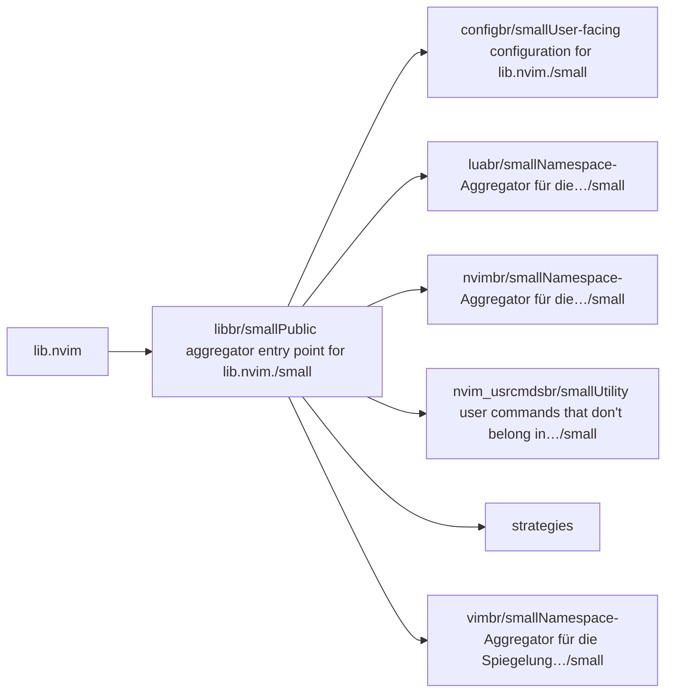
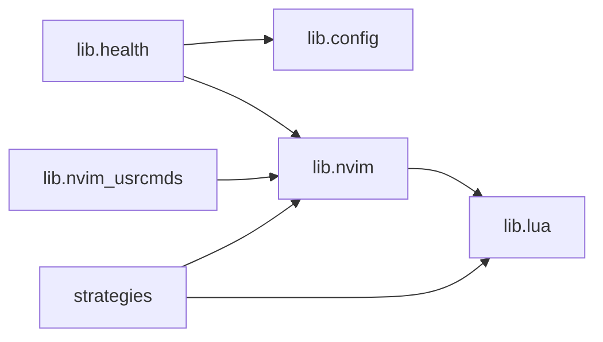

# lib.nvim — module map

> **Generated** by `documentation`. Do not edit by hand — run `:DocMap`
> (or `nvim --headless -l scripts/gen_map.lua`) to regenerate.

**141 modules** · 24 namespaces · 125 helper files

The [interactive map](index.html) has filtering, full descriptions and
source links; this page is the version the code host renders directly.


## Namespaces


```mermaid
flowchart LR
  nlua["lib.nvim"]
  nlua_lib["libbr/smallPublic aggregator entry point for lib.nvim./small"]
  nlua_lib_config["configbr/smallUser-facing configuration for lib.nvim./small"]
  nlua_lib_lua["luabr/smallNamespace-Aggregator für die…/small"]
  nlua_lib_nvim["nvimbr/smallNamespace-Aggregator für die…/small"]
  nlua_lib_nvim_usrcmds["nvim_usrcmdsbr/smallUtility user commands that don't belong in…/small"]
  nlua_lib_strategies["strategies"]
  nlua_lib_vim["vimbr/smallNamespace-Aggregator für die Spiegelung…/small"]
  nlua --> nlua_lib
  nlua_lib --> nlua_lib_config
  nlua_lib --> nlua_lib_lua
  nlua_lib --> nlua_lib_nvim
  nlua_lib --> nlua_lib_nvim_usrcmds
  nlua_lib --> nlua_lib_strategies
  nlua_lib --> nlua_lib_vim
```


## Dependencies

Which parts of the tree require which, rolled up to the second level.
The [interactive map](index.html)'s **Deps** view has this per module,
in both directions, with load-time and lazy requires told apart.


```mermaid
flowchart LR
  nlua_lib_config["lib.config"]
  nlua_lib_health_lua["lib.health"]
  nlua_lib_lua["lib.lua"]
  nlua_lib_nvim["lib.nvim"]
  nlua_lib_nvim_usrcmds["lib.nvim_usrcmds"]
  nlua_lib_strategies["strategies"]
  nlua_lib_health_lua --> nlua_lib_config
  nlua_lib_health_lua --> nlua_lib_nvim
  nlua_lib_nvim --> nlua_lib_lua
  nlua_lib_nvim_usrcmds --> nlua_lib_nvim
  nlua_lib_strategies --> nlua_lib_lua
  nlua_lib_strategies --> nlua_lib_nvim
```


## Modules

| Module | Description | Fns | Docs |
|---|---|---|---|
| `lib` | Public aggregator entry point for lib.nvim. |  | [README](../../lua/lib/README.md) · [src](../../lua/lib/init.lua) |
| &nbsp;&nbsp;`lib.config` | User-facing configuration for lib.nvim. | 3 | [README](../../lua/lib/config/README.md) · [src](../../lua/lib/config/init.lua) |
| &nbsp;&nbsp;`lib.lua` | Namespace-Aggregator für die editorunabhängigen Lua-Helfer. |  | [README](../../lua/lib/lua/README.md) · [src](../../lua/lib/lua/init.lua) |
| &nbsp;&nbsp;&nbsp;&nbsp;`lib.lua.diff` | Aggregated export for line-diff helpers: `lines` (cheap splice-region diff) and `myers` (full DP LCS-based edit script). |  | [README](../../lua/lib/lua/diff/README.md) · [src](../../lua/lib/lua/diff/init.lua) |
| &nbsp;&nbsp;&nbsp;&nbsp;`lib.lua.dump` | Recursive Lua value dumper, pure Lua — an alternative/complement to `vim.inspect` for tables/metatables/functions/threads/userdata, with a hard… | 3 | [README](../../lua/lib/lua/dump/README.md) · [src](../../lua/lib/lua/dump/init.lua) |
| &nbsp;&nbsp;&nbsp;&nbsp;`lib.lua.error` | Structured-error + safe-call-with-traceback convention, pure Lua. | 3 | [README](../../lua/lib/lua/error/README.md) · [src](../../lua/lib/lua/error/init.lua) |
| &nbsp;&nbsp;&nbsp;&nbsp;`lib.lua.functions` | Aggregator for lib.lua's higher-order function helpers (noop, identity, const, raise, etc.), lazily delegating to lib.lua.functions.meta. |  | [README](../../lua/lib/lua/functions/README.md) · [src](../../lua/lib/lua/functions/init.lua) |
| &nbsp;&nbsp;&nbsp;&nbsp;`lib.lua.json` | Aggregator for lib.lua's pure-Lua JSON encode/decode helpers. |  | [README](../../lua/lib/lua/json/README.md) · [src](../../lua/lib/lua/json/init.lua) |
| &nbsp;&nbsp;&nbsp;&nbsp;&nbsp;&nbsp;`lib.lua.json.decode` | Decode namespace marker. |  | [README](../../lua/lib/lua/json/decode/README.md) · [src](../../lua/lib/lua/json/decode/init.lua) |
| &nbsp;&nbsp;&nbsp;&nbsp;&nbsp;&nbsp;`lib.lua.json.encode` | Pure-Lua JSON encoder — the counterpart to `lib.lua.json.decode`. | 7 | [README](../../lua/lib/lua/json/encode/README.md) · [src](../../lua/lib/lua/json/encode/init.lua) |
| &nbsp;&nbsp;&nbsp;&nbsp;`lib.lua.lazy` | Provides reusable helpers for safe and explicit lazy-loading of Lua modules in Neovim. | 4 | [README](../../lua/lib/lua/lazy/README.md) · [src](../../lua/lib/lua/lazy/init.lua) |
| &nbsp;&nbsp;&nbsp;&nbsp;`lib.lua.memo` | Aggregated export for cache helpers with enhanced API. | 2 | [README](../../lua/lib/lua/memo/README.md) · [src](../../lua/lib/lua/memo/init.lua) |
| &nbsp;&nbsp;&nbsp;&nbsp;`lib.lua.numeral` | Aggregated export for numeral conversion helpers: `roman` and `alpha`. |  | [README](../../lua/lib/lua/numeral/README.md) · [src](../../lua/lib/lua/numeral/init.lua) |
| &nbsp;&nbsp;&nbsp;&nbsp;`lib.lua.strings` | Aggregator for lib.lua's pure-Lua string helpers: case conversion, padding, trimming, splitting/joining, and other string utilities. |  | [README](../../lua/lib/lua/strings/README.md) · [src](../../lua/lib/lua/strings/init.lua) |
| &nbsp;&nbsp;&nbsp;&nbsp;&nbsp;&nbsp;`convert` |  |  |  |
| &nbsp;&nbsp;&nbsp;&nbsp;&nbsp;&nbsp;`lib.lua.strings.transform` | Aggregated string transformation helpers. |  | [README](../../lua/lib/lua/strings/transform/README.md) · [src](../../lua/lib/lua/strings/transform/init.lua) |
| &nbsp;&nbsp;&nbsp;&nbsp;`lib.lua.tables` | Aggregated export for table helpers. |  | [README](../../lua/lib/lua/tables/README.md) · [src](../../lua/lib/lua/tables/init.lua) |
| &nbsp;&nbsp;&nbsp;&nbsp;`time` |  |  |  |
| &nbsp;&nbsp;&nbsp;&nbsp;&nbsp;&nbsp;`lib.lua.time.diff` | Provides a lightweight, reusable timer object for measuring elapsed time between code sections. | 1 | [README](../../lua/lib/lua/time/diff/README.md) · [src](../../lua/lib/lua/time/diff/init.lua) |
| &nbsp;&nbsp;&nbsp;&nbsp;&nbsp;&nbsp;&nbsp;&nbsp;`internal` |  |  |  |
| &nbsp;&nbsp;&nbsp;&nbsp;&nbsp;&nbsp;`lib.lua.time.format` | Format a unix timestamp using a small set of named style presets, pure Lua (`os.date`), no `vim.*`. | 1 | [README](../../lua/lib/lua/time/format/README.md) · [src](../../lua/lib/lua/time/format/init.lua) |
| &nbsp;&nbsp;&nbsp;&nbsp;&nbsp;&nbsp;`lib.lua.time.presets` | Date-range preset resolver, pure Lua (`os.time`/`os.date`), no `vim.*`. | 9 | [README](../../lua/lib/lua/time/presets/README.md) · [src](../../lua/lib/lua/time/presets/init.lua) |
| &nbsp;&nbsp;&nbsp;&nbsp;`lib.lua.uuid` | UUIDv4 generation and formatting helpers, pure Lua (no `vim.*`). | 4 | [README](../../lua/lib/lua/uuid/README.md) · [src](../../lua/lib/lua/uuid/init.lua) |
| &nbsp;&nbsp;&nbsp;&nbsp;`lib.lua.yaml` | Deliberately minimal, dependency-free YAML-ish decoder, pure Lua. | 7 | [README](../../lua/lib/lua/yaml/README.md) · [src](../../lua/lib/lua/yaml/init.lua) |
| &nbsp;&nbsp;`lib.nvim` | Namespace-Aggregator für die Neovim-spezifischen Helfer. |  | [README](../../lua/lib/nvim/README.md) · [src](../../lua/lib/nvim/init.lua) |
| &nbsp;&nbsp;&nbsp;&nbsp;`lib.nvim.autocmd` | ========================================================= Autocommand helper utilities. | 5 | [README](../../lua/lib/nvim/autocmd/README.md) · [src](../../lua/lib/nvim/autocmd/init.lua) |
| &nbsp;&nbsp;&nbsp;&nbsp;&nbsp;&nbsp;`lib.nvim.autocmd.dispatcher` | Generic, event-agnostic autocmd dispatcher: one autocmd, many handlers. | 4 | [README](../../lua/lib/nvim/autocmd/dispatcher/README.md) · [src](../../lua/lib/nvim/autocmd/dispatcher/init.lua) |
| &nbsp;&nbsp;&nbsp;&nbsp;`buf_win_tab` |  |  |  |
| &nbsp;&nbsp;&nbsp;&nbsp;&nbsp;&nbsp;`lib.nvim.buf_win_tab.capture` | Deterministic capture of buffers and windows created by Ex commands. | 7 | [README](../../lua/lib/nvim/buf_win_tab/capture/README.md) · [src](../../lua/lib/nvim/buf_win_tab/capture/init.lua) |
| &nbsp;&nbsp;&nbsp;&nbsp;&nbsp;&nbsp;`lib.nvim.buf_win_tab.get_option` | Read a buffer option across a wide range of Neovim versions. |  | [README](../../lua/lib/nvim/buf_win_tab/get_option/README.md) · [src](../../lua/lib/nvim/buf_win_tab/get_option/init.lua) |
| &nbsp;&nbsp;&nbsp;&nbsp;&nbsp;&nbsp;`lib.nvim.buf_win_tab.move_buffer_to_tab` | Moves the current buffer into a new tab and removes it from the original tab |  | [README](../../lua/lib/nvim/buf_win_tab/move_buffer_to_tab/README.md) · [src](../../lua/lib/nvim/buf_win_tab/move_buffer_to_tab/init.lua) |
| &nbsp;&nbsp;&nbsp;&nbsp;&nbsp;&nbsp;`lib.nvim.buf_win_tab.normal_buffer` | Shared buffer/window primitives around "normal" file buffers. | 4 | [README](../../lua/lib/nvim/buf_win_tab/normal_buffer/README.md) · [src](../../lua/lib/nvim/buf_win_tab/normal_buffer/init.lua) |
| &nbsp;&nbsp;&nbsp;&nbsp;&nbsp;&nbsp;`lib.nvim.buf_win_tab.resize_guarded` | Guarded resize helper that allows window resize shortcuts in normal editors while preserving keypresses in terminals and special plugin buffers. | 3 | [README](../../lua/lib/nvim/buf_win_tab/resize_guarded/README.md) · [src](../../lua/lib/nvim/buf_win_tab/resize_guarded/init.lua) |
| &nbsp;&nbsp;&nbsp;&nbsp;&nbsp;&nbsp;`lib.nvim.buf_win_tab.safe_adjacent_buffer` | Helper to force-save the last usable file buffer via :w! | 2 | [README](../../lua/lib/nvim/buf_win_tab/safe_adjacent_buffer/README.md) · [src](../../lua/lib/nvim/buf_win_tab/safe_adjacent_buffer/init.lua) |
| &nbsp;&nbsp;&nbsp;&nbsp;&nbsp;&nbsp;`lib.nvim.buf_win_tab.selection` | Read the visual selection, whether or not visual mode is still active. | 2 | [README](../../lua/lib/nvim/buf_win_tab/selection/README.md) · [src](../../lua/lib/nvim/buf_win_tab/selection/init.lua) |
| &nbsp;&nbsp;&nbsp;&nbsp;&nbsp;&nbsp;`lib.nvim.buf_win_tab.word_under_cursor` | Extract the word under the cursor using a configurable word-character pattern, and report its byte span. |  | [README](../../lua/lib/nvim/buf_win_tab/word_under_cursor/README.md) · [src](../../lua/lib/nvim/buf_win_tab/word_under_cursor/init.lua) |
| &nbsp;&nbsp;&nbsp;&nbsp;`buffer` |  |  |  |
| &nbsp;&nbsp;&nbsp;&nbsp;&nbsp;&nbsp;`lib.nvim.buffer.context` | Buffer-metadata accessor cached by `changedtick`. | 7 | [README](../../lua/lib/nvim/buffer/context/README.md) · [src](../../lua/lib/nvim/buffer/context/init.lua) |
| &nbsp;&nbsp;&nbsp;&nbsp;`lib.nvim.cache` | Caching namespace: a persistent JSON disk cache and a generic in-memory TTL/changedtick namespace cache for event handlers. |  | [README](../../lua/lib/nvim/cache/README.md) · [src](../../lua/lib/nvim/cache/init.lua) |
| &nbsp;&nbsp;&nbsp;&nbsp;`lib.nvim.core` | Executable-on-PATH lookups (memoized) plus lib.nvim.core's own aggregated helpers, e.g. | 3 | [README](../../lua/lib/nvim/core/README.md) · [src](../../lua/lib/nvim/core/init.lua) |
| &nbsp;&nbsp;&nbsp;&nbsp;`lib.nvim.cross` | Cross-platform utilities for Neovim/Lua Provides platform detection, path normalization, and shell helpers |  | [README](../../lua/lib/nvim/cross/README.md) · [src](../../lua/lib/nvim/cross/init.lua) |
| &nbsp;&nbsp;&nbsp;&nbsp;&nbsp;&nbsp;`lib.nvim.cross.copy_to_clipboard` | Cross-platform clipboard write. | 1 | [README](../../lua/lib/nvim/cross/copy_to_clipboard/README.md) · [src](../../lua/lib/nvim/cross/copy_to_clipboard/init.lua) |
| &nbsp;&nbsp;&nbsp;&nbsp;&nbsp;&nbsp;`lib.nvim.cross.executable` | Executable lookup helpers: PATH resolution and Mason-managed binaries. | 4 | [README](../../lua/lib/nvim/cross/executable/README.md) · [src](../../lua/lib/nvim/cross/executable/init.lua) |
| &nbsp;&nbsp;&nbsp;&nbsp;&nbsp;&nbsp;`fs` |  |  |  |
| &nbsp;&nbsp;&nbsp;&nbsp;&nbsp;&nbsp;&nbsp;&nbsp;`lib.nvim.cross.fs._cwd` | Resolve the current working directory via libuv, compatible across NVIM versions. |  | [README](../../lua/lib/nvim/cross/fs/_cwd/README.md) · [src](../../lua/lib/nvim/cross/fs/_cwd/init.lua) |
| &nbsp;&nbsp;&nbsp;&nbsp;&nbsp;&nbsp;&nbsp;&nbsp;`lib.nvim.cross.fs.expand_path` | Expand `~`, `$VAR` (POSIX) and `%VAR%` (Windows) references in a raw path string. |  | [README](../../lua/lib/nvim/cross/fs/expand_path/README.md) · [src](../../lua/lib/nvim/cross/fs/expand_path/init.lua) |
| &nbsp;&nbsp;&nbsp;&nbsp;&nbsp;&nbsp;&nbsp;&nbsp;`lib.nvim.cross.fs.lock` | Diagnose *who* is holding a file open on Windows — the counterpart to `lib.nvim.cross.fs.mutate`, which can only tell you *that* a mutation failed with… | 6 | [README](../../lua/lib/nvim/cross/fs/lock/README.md) · [src](../../lua/lib/nvim/cross/fs/lock/init.lua) |
| &nbsp;&nbsp;&nbsp;&nbsp;&nbsp;&nbsp;&nbsp;&nbsp;`lib.nvim.cross.fs.mutate` | Injection-safe file mutation primitives, built directly on libuv (no shell involved) — safe to use with untrusted/user-controlled paths. | 8 | [README](../../lua/lib/nvim/cross/fs/mutate/README.md) · [src](../../lua/lib/nvim/cross/fs/mutate/init.lua) |
| &nbsp;&nbsp;&nbsp;&nbsp;&nbsp;&nbsp;&nbsp;&nbsp;`separators` |  |  | [README](../../lua/lib/nvim/cross/fs/separators/README.md) |
| &nbsp;&nbsp;&nbsp;&nbsp;&nbsp;&nbsp;&nbsp;&nbsp;&nbsp;&nbsp;`lib.nvim.cross.fs.separators.collapse_dots` | Lexically collapse '.'/'..' segments and repeated separators in a path. | 6 | [README](../../lua/lib/nvim/cross/fs/separators/collapse_dots/README.md) · [src](../../lua/lib/nvim/cross/fs/separators/collapse_dots/init.lua) |
| &nbsp;&nbsp;&nbsp;&nbsp;&nbsp;&nbsp;&nbsp;&nbsp;&nbsp;&nbsp;`lib.nvim.cross.fs.separators.drive_upper` | Uppercase a Windows drive-letter prefix ("c:/foo" -> "C:/foo"). |  | [README](../../lua/lib/nvim/cross/fs/separators/drive_upper/README.md) · [src](../../lua/lib/nvim/cross/fs/separators/drive_upper/init.lua) |
| &nbsp;&nbsp;&nbsp;&nbsp;&nbsp;&nbsp;&nbsp;&nbsp;&nbsp;&nbsp;`lib.nvim.cross.fs.separators.has_win_sep` | Detects a Windows drive-prefix ("C:\" or "C:/") at the start of a path. |  | [README](../../lua/lib/nvim/cross/fs/separators/has_win_sep/README.md) · [src](../../lua/lib/nvim/cross/fs/separators/has_win_sep/init.lua) |
| &nbsp;&nbsp;&nbsp;&nbsp;&nbsp;&nbsp;&nbsp;&nbsp;&nbsp;&nbsp;`lib.nvim.cross.fs.separators.normalize` | Normalizes path separators for the current OS. |  | [README](../../lua/lib/nvim/cross/fs/separators/normalize/README.md) · [src](../../lua/lib/nvim/cross/fs/separators/normalize/init.lua) |
| &nbsp;&nbsp;&nbsp;&nbsp;&nbsp;&nbsp;&nbsp;&nbsp;&nbsp;&nbsp;`lib.nvim.cross.fs.separators.unify_slashes` | Convert every backslash in `path` to a forward slash — a pure string transform: no expansion, no absolute-path resolution, no collapsing of repeated… |  | [README](../../lua/lib/nvim/cross/fs/separators/unify_slashes/README.md) · [src](../../lua/lib/nvim/cross/fs/separators/unify_slashes/init.lua) |
| &nbsp;&nbsp;&nbsp;&nbsp;&nbsp;&nbsp;&nbsp;&nbsp;`lib.nvim.cross.fs.wslpath` | Convert paths between their WSL (unix) and Windows forms via the `wslpath` binary that ships with every WSL distribution. | 3 | [README](../../lua/lib/nvim/cross/fs/wslpath/README.md) · [src](../../lua/lib/nvim/cross/fs/wslpath/init.lua) |
| &nbsp;&nbsp;&nbsp;&nbsp;&nbsp;&nbsp;`lib.nvim.cross.open_default` | Open a path or URL with the system's default application — the cross-platform equivalent of double-clicking it in a file manager (extension/URL-scheme… | 2 | [README](../../lua/lib/nvim/cross/open_default/README.md) · [src](../../lua/lib/nvim/cross/open_default/init.lua) |
| &nbsp;&nbsp;&nbsp;&nbsp;&nbsp;&nbsp;`platform` |  |  |  |
| &nbsp;&nbsp;&nbsp;&nbsp;&nbsp;&nbsp;`lib.nvim.cross.reveal_in_fm` | Show a path in the system file manager — "reveal in Explorer/Finder/…", as opposed to `lib.nvim.cross.open_default`, which hands the path to the… | 8 | [README](../../lua/lib/nvim/cross/reveal_in_fm/README.md) · [src](../../lua/lib/nvim/cross/reveal_in_fm/init.lua) |
| &nbsp;&nbsp;&nbsp;&nbsp;&nbsp;&nbsp;`lib.nvim.cross.run` | Shell selection and runners FIX: Optimize, doc | 5 | [README](../../lua/lib/nvim/cross/run/README.md) · [src](../../lua/lib/nvim/cross/run/init.lua) |
| &nbsp;&nbsp;&nbsp;&nbsp;&nbsp;&nbsp;&nbsp;&nbsp;`lib.nvim.cross.run.env` | Spawn-environment builder for subprocesses started from Neovim. | 15 | [README](../../lua/lib/nvim/cross/run/env/README.md) · [src](../../lua/lib/nvim/cross/run/env/init.lua) |
| &nbsp;&nbsp;&nbsp;&nbsp;&nbsp;&nbsp;`lib.nvim.cross.run_argv` | Low-level argv-based process runner with stdin support. | 2 | [README](../../lua/lib/nvim/cross/run_argv/README.md) · [src](../../lua/lib/nvim/cross/run_argv/init.lua) |
| &nbsp;&nbsp;&nbsp;&nbsp;&nbsp;&nbsp;`uv` |  |  |  |
| &nbsp;&nbsp;&nbsp;&nbsp;&nbsp;&nbsp;&nbsp;&nbsp;`lib.nvim.cross.uv.fs` | Resolve the current working directory via libuv, compatible across NVIM versions. |  | [README](../../lua/lib/nvim/cross/uv/fs/README.md) · [src](../../lua/lib/nvim/cross/uv/fs/init.lua) |
| &nbsp;&nbsp;&nbsp;&nbsp;&nbsp;&nbsp;&nbsp;&nbsp;`lib.nvim.cross.uv.spawn_capture` | Async spawn of an argv command with buffered stdout/stderr capture and an optional timeout. | 1 | [README](../../lua/lib/nvim/cross/uv/spawn_capture/README.md) · [src](../../lua/lib/nvim/cross/uv/spawn_capture/init.lua) |
| &nbsp;&nbsp;&nbsp;&nbsp;&nbsp;&nbsp;&nbsp;&nbsp;`lib.nvim.cross.uv.spawn_stream` | Async spawn of an argv command with **line-by-line** streaming of stdout/stderr and an optional timeout. | 2 | [README](../../lua/lib/nvim/cross/uv/spawn_stream/README.md) · [src](../../lua/lib/nvim/cross/uv/spawn_stream/init.lua) |
| &nbsp;&nbsp;&nbsp;&nbsp;&nbsp;&nbsp;&nbsp;&nbsp;`lib.nvim.cross.uv.wait_until` | Poll a predicate on a libuv timer until it returns true or a maximum number of attempts is reached. |  | [README](../../lua/lib/nvim/cross/uv/wait_until/README.md) · [src](../../lua/lib/nvim/cross/uv/wait_until/init.lua) |
| &nbsp;&nbsp;&nbsp;&nbsp;`lib.nvim.debounce` | Generic debounce primitive for callbacks. | 2 | [README](../../lua/lib/nvim/debounce/README.md) · [src](../../lua/lib/nvim/debounce/init.lua) |
| &nbsp;&nbsp;&nbsp;&nbsp;&nbsp;&nbsp;`lib.nvim.debounce.buffer` | Buffer-scoped debounce: one independent timer per `bufnr`. | 1 | [README](../../lua/lib/nvim/debounce/buffer/README.md) · [src](../../lua/lib/nvim/debounce/buffer/init.lua) |
| &nbsp;&nbsp;&nbsp;&nbsp;`lib.nvim.deps` | External-tool detection, declared-dependency spec parsing, and an opt-in `:Lib deps` surface, for plugins that degrade gracefully without optional CLI tools… | 7 | [README](../../lua/lib/nvim/deps/README.md) · [src](../../lua/lib/nvim/deps/init.lua) |
| &nbsp;&nbsp;&nbsp;&nbsp;&nbsp;&nbsp;`lib.nvim.deps.install` | Turn a parsed tool spec into an install plan, and — only on an explicit, confirmed call — put the composed command in front of the user in a terminal… | 4 | [src](../../lua/lib/nvim/deps/install/init.lua) |
| &nbsp;&nbsp;&nbsp;&nbsp;&nbsp;&nbsp;`lib.nvim.deps.pm` | OS package-manager detection and install-command composition. | 9 | [src](../../lua/lib/nvim/deps/pm/init.lua) |
| &nbsp;&nbsp;&nbsp;&nbsp;&nbsp;&nbsp;`lib.nvim.deps.spec` | Parse + validate a plugin's declared external-tool requirements from either `docs/INSTALL.md` (```install-tool fenced blocks, YAML-ish body — see… | 11 | [src](../../lua/lib/nvim/deps/spec/init.lua) |
| &nbsp;&nbsp;&nbsp;&nbsp;`lib.nvim.dotrepeat` | Wire native Vim `.`-repeat through the `operatorfunc` mechanism, without depending on `vim-repeat` or any other plugin. | 3 | [README](../../lua/lib/nvim/dotrepeat/README.md) · [src](../../lua/lib/nvim/dotrepeat/init.lua) |
| &nbsp;&nbsp;&nbsp;&nbsp;`fs` |  |  |  |
| &nbsp;&nbsp;&nbsp;&nbsp;&nbsp;&nbsp;`lib.nvim.fs.chdir` | Scope-aware working-directory change: global (`:cd`), tab-local (`:tcd`) or window-local (`:lcd`), with normalization, validation and no throwing. | 2 | [README](../../lua/lib/nvim/fs/chdir/README.md) · [src](../../lua/lib/nvim/fs/chdir/init.lua) |
| &nbsp;&nbsp;&nbsp;&nbsp;&nbsp;&nbsp;`lib.nvim.fs.collect_recursive` | Recursive directory walker built on `fs_scandir`/`fs_scandir_next`. | 10 | [README](../../lua/lib/nvim/fs/collect_recursive/README.md) · [src](../../lua/lib/nvim/fs/collect_recursive/init.lua) |
| &nbsp;&nbsp;&nbsp;&nbsp;&nbsp;&nbsp;`lib.nvim.fs.create_entry` | Create a file or directory relative to a parent directory. | 2 | [README](../../lua/lib/nvim/fs/create_entry/README.md) · [src](../../lua/lib/nvim/fs/create_entry/init.lua) |
| &nbsp;&nbsp;&nbsp;&nbsp;&nbsp;&nbsp;`lib.nvim.fs.dir_guard` | Hold the working directory on a path until released. | 3 | [README](../../lua/lib/nvim/fs/dir_guard/README.md) · [src](../../lua/lib/nvim/fs/dir_guard/init.lua) |
| &nbsp;&nbsp;&nbsp;&nbsp;&nbsp;&nbsp;`lib.nvim.fs.find_root` | Cached, marker-based project-root finder. |  | [README](../../lua/lib/nvim/fs/find_root/README.md) · [src](../../lua/lib/nvim/fs/find_root/init.lua) |
| &nbsp;&nbsp;&nbsp;&nbsp;&nbsp;&nbsp;`lib.nvim.fs.find_upward_dir` | Walk upward from `from` and return the nearest ancestor directory holding one of `names`. |  | [README](../../lua/lib/nvim/fs/find_upward_dir/README.md) · [src](../../lua/lib/nvim/fs/find_upward_dir/init.lua) |
| &nbsp;&nbsp;&nbsp;&nbsp;&nbsp;&nbsp;`ignore` |  |  |  |
| &nbsp;&nbsp;&nbsp;&nbsp;&nbsp;&nbsp;&nbsp;&nbsp;`lib.nvim.fs.ignore.list` | Canonical filesystem ignore definitions for developer tooling. | 5 | [README](../../lua/lib/nvim/fs/ignore/list/README.md) · [src](../../lua/lib/nvim/fs/ignore/list/init.lua) |
| &nbsp;&nbsp;&nbsp;&nbsp;&nbsp;&nbsp;`lib.nvim.fs.is_dir` | True when `p` exists and is a directory. |  | [README](../../lua/lib/nvim/fs/is_dir/README.md) · [src](../../lua/lib/nvim/fs/is_dir/init.lua) |
| &nbsp;&nbsp;&nbsp;&nbsp;&nbsp;&nbsp;`lib.nvim.fs.is_readable_file` | Ensure the path is valid |  | [README](../../lua/lib/nvim/fs/is_readable_file/README.md) · [src](../../lua/lib/nvim/fs/is_readable_file/init.lua) |
| &nbsp;&nbsp;&nbsp;&nbsp;&nbsp;&nbsp;`lib.nvim.fs.is_subpath` | `vim.fs.normalize` always returns forward-slash paths (on every OS, including Windows) — so the separator used below must be "/" too. |  | [README](../../lua/lib/nvim/fs/is_subpath/README.md) · [src](../../lua/lib/nvim/fs/is_subpath/init.lua) |
| &nbsp;&nbsp;&nbsp;&nbsp;&nbsp;&nbsp;`lib.nvim.fs.is_valid_filename` | Validate a bare filename (not a full path) for filesystem safety. |  | [README](../../lua/lib/nvim/fs/is_valid_filename/README.md) · [src](../../lua/lib/nvim/fs/is_valid_filename/init.lua) |
| &nbsp;&nbsp;&nbsp;&nbsp;&nbsp;&nbsp;`lib.nvim.fs.json` | Read/write JSON files, built on `lib.lua.json.encode` for encoding plus `lib.nvim.fs.read` and `lib.nvim.fs.write.to_file`. | 2 | [README](../../lua/lib/nvim/fs/json/README.md) · [src](../../lua/lib/nvim/fs/json/init.lua) |
| &nbsp;&nbsp;&nbsp;&nbsp;&nbsp;&nbsp;`lib.nvim.fs.mkdirp` | Recursive directory creation (`mkdir -p`) built purely on libuv. | 2 | [README](../../lua/lib/nvim/fs/mkdirp/README.md) · [src](../../lua/lib/nvim/fs/mkdirp/init.lua) |
| &nbsp;&nbsp;&nbsp;&nbsp;&nbsp;&nbsp;`lib.nvim.fs.normkey` | Canonical, cross-platform cache/dedup key for a filesystem path. |  | [README](../../lua/lib/nvim/fs/normkey/README.md) · [src](../../lua/lib/nvim/fs/normkey/init.lua) |
| &nbsp;&nbsp;&nbsp;&nbsp;&nbsp;&nbsp;`open` |  |  |  |
| &nbsp;&nbsp;&nbsp;&nbsp;&nbsp;&nbsp;&nbsp;&nbsp;`url` |  |  |  |
| &nbsp;&nbsp;&nbsp;&nbsp;&nbsp;&nbsp;&nbsp;&nbsp;&nbsp;&nbsp;`lib.nvim.fs.open.url.system_opener` | Open a path/URL with the OS default handler — the shared per-OS dispatch every plugin that shells out to `open`/`xdg-open`/`start` was reimplementing… | 3 | [README](../../lua/lib/nvim/fs/open/url/system_opener/README.md) · [src](../../lua/lib/nvim/fs/open/url/system_opener/init.lua) |
| &nbsp;&nbsp;&nbsp;&nbsp;&nbsp;&nbsp;`lib.nvim.fs.path` | Path helpers: repo-relative-to-absolute resolution, joining, and ensuring a directory exists. | 4 | [README](../../lua/lib/nvim/fs/path/README.md) · [src](../../lua/lib/nvim/fs/path/init.lua) |
| &nbsp;&nbsp;&nbsp;&nbsp;&nbsp;&nbsp;`lib.nvim.fs.path_shorten` | Utility module to shorten file paths for display. | 11 | [README](../../lua/lib/nvim/fs/path_shorten/README.md) · [src](../../lua/lib/nvim/fs/path_shorten/init.lua) |
| &nbsp;&nbsp;&nbsp;&nbsp;&nbsp;&nbsp;`lib.nvim.fs.polymorphic_rootresolver` | Generic polymorphic root-directory resolver for Neovim LSPs. |  | [README](../../lua/lib/nvim/fs/polymorphic_rootresolver/README.md) · [src](../../lua/lib/nvim/fs/polymorphic_rootresolver/init.lua) |
| &nbsp;&nbsp;&nbsp;&nbsp;&nbsp;&nbsp;`lib.nvim.fs.project_key` | Stable per-project cache key: prefers the Git root of `path` (default cwd), falls back to `path`/cwd itself, and runs the result through `lib.nvim.fs.normkey`… |  | [README](../../lua/lib/nvim/fs/project_key/README.md) · [src](../../lua/lib/nvim/fs/project_key/init.lua) |
| &nbsp;&nbsp;&nbsp;&nbsp;&nbsp;&nbsp;`lib.nvim.fs.read` | Read the whole contents of a file at `path` into a string. |  | [README](../../lua/lib/nvim/fs/read/README.md) · [src](../../lua/lib/nvim/fs/read/init.lua) |
| &nbsp;&nbsp;&nbsp;&nbsp;&nbsp;&nbsp;`lib.nvim.fs.relpath` | Compute `path` relative to `base`. |  | [README](../../lua/lib/nvim/fs/relpath/README.md) · [src](../../lua/lib/nvim/fs/relpath/init.lua) |
| &nbsp;&nbsp;&nbsp;&nbsp;&nbsp;&nbsp;`lib.nvim.fs.scan_cached` | Recursively scan one root directory, memoized in-memory with a TTL — the session-lifetime counterpart to `scan_roots` (which persists to disk across… | 2 | [README](../../lua/lib/nvim/fs/scan_cached/README.md) · [src](../../lua/lib/nvim/fs/scan_cached/init.lua) |
| &nbsp;&nbsp;&nbsp;&nbsp;&nbsp;&nbsp;`lib.nvim.fs.scan_roots` | Scan multiple root directories for files (or dirs), with optional directory-name ignoring and an optional TTL-based on-disk cache. | 3 | [README](../../lua/lib/nvim/fs/scan_roots/README.md) · [src](../../lua/lib/nvim/fs/scan_roots/init.lua) |
| &nbsp;&nbsp;&nbsp;&nbsp;&nbsp;&nbsp;`lib.nvim.fs.trash` | Cross-platform "send to trash/recycle bin" (not a permanent delete). | 11 | [README](../../lua/lib/nvim/fs/trash/README.md) · [src](../../lua/lib/nvim/fs/trash/init.lua) |
| &nbsp;&nbsp;&nbsp;&nbsp;&nbsp;&nbsp;`write` |  |  |  |
| &nbsp;&nbsp;&nbsp;&nbsp;&nbsp;&nbsp;&nbsp;&nbsp;`lib.nvim.fs.write.append` | Append `content` to a file, creating parent directories as needed. |  | [README](../../lua/lib/nvim/fs/write/append/README.md) · [src](../../lua/lib/nvim/fs/write/append/init.lua) |
| &nbsp;&nbsp;&nbsp;&nbsp;&nbsp;&nbsp;&nbsp;&nbsp;`lib.nvim.fs.write.async` | Asynchronous counterpart to `lib.nvim.fs.write.to_file`: creates the parent directory synchronously, then opens/writes/closes the file via libuv without… |  | [README](../../lua/lib/nvim/fs/write/async/README.md) · [src](../../lua/lib/nvim/fs/write/async/init.lua) |
| &nbsp;&nbsp;&nbsp;&nbsp;&nbsp;&nbsp;&nbsp;&nbsp;`lib.nvim.fs.write.batch` | Write many files asynchronously and invoke one callback when all of them have finished (success or failure). |  | [README](../../lua/lib/nvim/fs/write/batch/README.md) · [src](../../lua/lib/nvim/fs/write/batch/init.lua) |
| &nbsp;&nbsp;&nbsp;&nbsp;&nbsp;&nbsp;&nbsp;&nbsp;`lib.nvim.fs.write.to_file` | Synchronous, byte-exact file write: creates parent directories and appends a trailing newline if the content doesn't already end with one. |  | [README](../../lua/lib/nvim/fs/write/to_file/README.md) · [src](../../lua/lib/nvim/fs/write/to_file/init.lua) |
| &nbsp;&nbsp;&nbsp;&nbsp;`lib.nvim.git` | Git utility helpers for Neovim. | 13 | [README](../../lua/lib/nvim/git/README.md) · [src](../../lua/lib/nvim/git/init.lua) |
| &nbsp;&nbsp;&nbsp;&nbsp;`lib.nvim.harvest` | Building blocks for "collect something from a scope, then show or export it" features. | 2 | [README](../../lua/lib/nvim/harvest/README.md) · [src](../../lua/lib/nvim/harvest/init.lua) |
| &nbsp;&nbsp;&nbsp;&nbsp;`lib.nvim.logger` | Structured logging, diagnostics and crash dumps for lib.nvim plugins. | 12 | [README](../../lua/lib/nvim/logger/README.md) · [src](../../lua/lib/nvim/logger/init.lua) |
| &nbsp;&nbsp;&nbsp;&nbsp;`lua_ls` |  |  |  |
| &nbsp;&nbsp;&nbsp;&nbsp;&nbsp;&nbsp;`lib.nvim.lua_ls.get_module_path` | Convert file path to Lua module path |  | [README](../../lua/lib/nvim/lua_ls/get_module_path/README.md) · [src](../../lua/lib/nvim/lua_ls/get_module_path/init.lua) |
| &nbsp;&nbsp;&nbsp;&nbsp;&nbsp;&nbsp;`insert` |  |  |  |
| &nbsp;&nbsp;&nbsp;&nbsp;&nbsp;&nbsp;&nbsp;&nbsp;`lib.nvim.lua_ls.insert.module_annnotation` | Insert a LuaLS @module annotation into a buffer at a configurable position |  | [README](../../lua/lib/nvim/lua_ls/insert/module_annnotation/README.md) · [src](../../lua/lib/nvim/lua_ls/insert/module_annnotation/init.lua) |
| &nbsp;&nbsp;&nbsp;&nbsp;`lib.nvim.map` | ========================================================= Keymap helper utilities. | 1 | [README](../../lua/lib/nvim/map/README.md) · [src](../../lua/lib/nvim/map/init.lua) |
| &nbsp;&nbsp;&nbsp;&nbsp;`neotree` |  |  |  |
| &nbsp;&nbsp;&nbsp;&nbsp;&nbsp;&nbsp;`lib.nvim.neotree.node` | Neo-tree node extraction utilities. | 5 | [README](../../lua/lib/nvim/neotree/node/README.md) · [src](../../lua/lib/nvim/neotree/node/init.lua) |
| &nbsp;&nbsp;&nbsp;&nbsp;&nbsp;&nbsp;`lib.nvim.neotree.watch` | Neo-tree file-watcher handle registry + proactive release. | 10 | [README](../../lua/lib/nvim/neotree/watch/README.md) · [src](../../lua/lib/nvim/neotree/watch/init.lua) |
| &nbsp;&nbsp;&nbsp;&nbsp;`net` |  |  |  |
| &nbsp;&nbsp;&nbsp;&nbsp;&nbsp;&nbsp;`lib.nvim.net.curl` | Async (and blocking) HTTP-via-curl helper, two tiers. | 9 | [README](../../lua/lib/nvim/net/curl/README.md) · [src](../../lua/lib/nvim/net/curl/init.lua) |
| &nbsp;&nbsp;&nbsp;&nbsp;`lib.nvim.normalize` | A small, dependency-free normalization toolkit for plugin configs. |  | [README](../../lua/lib/nvim/normalize/README.md) · [src](../../lua/lib/nvim/normalize/init.lua) |
| &nbsp;&nbsp;&nbsp;&nbsp;`lib.nvim.notify` | Allows per-module prefix configuration while mirroring vim.notify semantics. | 1 | [README](../../lua/lib/nvim/notify/README.md) · [src](../../lua/lib/nvim/notify/init.lua) |
| &nbsp;&nbsp;&nbsp;&nbsp;&nbsp;&nbsp;`lib.nvim.notify.resolve_log_level` | Resolves a log level parameter to a valid vim.log.levels integer value. |  | [README](../../lua/lib/nvim/notify/resolve_log_level/README.md) · [src](../../lua/lib/nvim/notify/resolve_log_level/init.lua) |
| &nbsp;&nbsp;&nbsp;&nbsp;&nbsp;&nbsp;`lib.nvim.notify.safe` | Provides helpers using vim.schedule, vim.defer_fn and vim.schedule_wrap to avoid calling vim.notify directly from contexts where it might cause issues (e.g.,… | 5 | [README](../../lua/lib/nvim/notify/safe/README.md) · [src](../../lua/lib/nvim/notify/safe/init.lua) |
| &nbsp;&nbsp;&nbsp;&nbsp;&nbsp;&nbsp;&nbsp;&nbsp;`docs` |  |  |  |
| &nbsp;&nbsp;&nbsp;&nbsp;`lib.nvim.progress` | Cross-platform progress indicator, decoupled from any single UI. | 3 | [README](../../lua/lib/nvim/progress/README.md) · [src](../../lua/lib/nvim/progress/init.lua) |
| &nbsp;&nbsp;&nbsp;&nbsp;&nbsp;&nbsp;`styles` |  |  |  |
| &nbsp;&nbsp;&nbsp;&nbsp;`lib.nvim.require` | Safe and extended require utilities | 3 | [README](../../lua/lib/nvim/require/README.md) · [src](../../lua/lib/nvim/require/init.lua) |
| &nbsp;&nbsp;&nbsp;&nbsp;`lib.nvim.safe_api` | Validated, pcall-wrapped `vim.api` accessors for buffers/windows. | 18 | [README](../../lua/lib/nvim/safe_api/README.md) · [src](../../lua/lib/nvim/safe_api/init.lua) |
| &nbsp;&nbsp;&nbsp;&nbsp;`lib.nvim.selection` | Reselect a Visual-mode line/char range after a mapping mutates the buffer. | 7 | [README](../../lua/lib/nvim/selection/README.md) · [src](../../lua/lib/nvim/selection/init.lua) |
| &nbsp;&nbsp;&nbsp;&nbsp;`lib.nvim.store` | Persistent-storage namespace. |  | [README](../../lua/lib/nvim/store/README.md) · [src](../../lua/lib/nvim/store/init.lua) |
| &nbsp;&nbsp;&nbsp;&nbsp;&nbsp;&nbsp;`lib.nvim.store.project` | Persistent state keyed by project, so reopening the same project (even on a different machine, via synced dotfiles/config) finds the same state again — as… | 7 | [README](../../lua/lib/nvim/store/project/README.md) · [src](../../lua/lib/nvim/store/project/init.lua) |
| &nbsp;&nbsp;&nbsp;&nbsp;`lib.nvim.system` | Host-environment namespace: OS/shell/path snapshot plus the Windows RPC-pipe helper. | 1 | [README](../../lua/lib/nvim/system/README.md) · [src](../../lua/lib/nvim/system/init.lua) |
| &nbsp;&nbsp;&nbsp;&nbsp;`lib.nvim.terminal` | Terminal helper functions: path escaping, terminal-buffer detection/cleanup, and Kitty-terminal detection. | 4 | [README](../../lua/lib/nvim/terminal/README.md) · [src](../../lua/lib/nvim/terminal/init.lua) |
| &nbsp;&nbsp;&nbsp;&nbsp;`lib.nvim.token` | Ephemeral session-nonce / token generator, for handshake IDs, temp-window IDs, correlation IDs, and similar internal bookkeeping. | 3 | [README](../../lua/lib/nvim/token/README.md) · [src](../../lua/lib/nvim/token/init.lua) |
| &nbsp;&nbsp;&nbsp;&nbsp;`treesitter` |  |  |  |
| &nbsp;&nbsp;&nbsp;&nbsp;&nbsp;&nbsp;`lib.nvim.treesitter.guard` | Filetype allowlist gate for treesitter-dependent features (highlighting, foldexpr, indentexpr). | 1 | [README](../../lua/lib/nvim/treesitter/guard/README.md) · [src](../../lua/lib/nvim/treesitter/guard/init.lua) |
| &nbsp;&nbsp;&nbsp;&nbsp;&nbsp;&nbsp;`lib.nvim.treesitter.parser_policy` | Prompt-or-auto-install policy for missing-but-available treesitter parsers. | 12 | [README](../../lua/lib/nvim/treesitter/parser_policy/README.md) · [src](../../lua/lib/nvim/treesitter/parser_policy/init.lua) |
| &nbsp;&nbsp;&nbsp;&nbsp;`ui` |  |  |  |
| &nbsp;&nbsp;&nbsp;&nbsp;&nbsp;&nbsp;`lib.nvim.ui.hl` | Highlight helper utilities. | 2 | [README](../../lua/lib/nvim/ui/hl/README.md) · [src](../../lua/lib/nvim/ui/hl/init.lua) |
| &nbsp;&nbsp;&nbsp;&nbsp;&nbsp;&nbsp;`lib.nvim.ui.kit` | Themed, composable UI toolkit for lib.nvim. | 17 | [README](../../lua/lib/nvim/ui/kit/README.md) · [src](../../lua/lib/nvim/ui/kit/init.lua) |
| &nbsp;&nbsp;&nbsp;&nbsp;&nbsp;&nbsp;`lib.nvim.ui.statusline` | A short status badge pinned to the bottom line of one window. | 5 | [README](../../lua/lib/nvim/ui/statusline/README.md) · [src](../../lua/lib/nvim/ui/statusline/init.lua) |
| &nbsp;&nbsp;&nbsp;&nbsp;`lib.nvim.usercmd` | User command helper utilities. | 1 | [README](../../lua/lib/nvim/usercmd/README.md) · [src](../../lua/lib/nvim/usercmd/init.lua) |
| &nbsp;&nbsp;&nbsp;&nbsp;&nbsp;&nbsp;`lib.nvim.usercmd.composer` | Compose a route spec into ONE Neovim user command with subcommands, `<Tab>` completion, and Markdown docs — all read from the same tree. | 15 | [README](../../lua/lib/nvim/usercmd/composer/README.md) · [src](../../lua/lib/nvim/usercmd/composer/init.lua) |
| &nbsp;&nbsp;&nbsp;&nbsp;`lib.nvim.window` | Window-control helpers for overlay / floating windows. | 1 | [README](../../lua/lib/nvim/window/README.md) · [src](../../lua/lib/nvim/window/init.lua) |
| &nbsp;&nbsp;&nbsp;&nbsp;&nbsp;&nbsp;`lib.nvim.window.context` | Window-metadata accessor with a same-event cache. | 5 | [README](../../lua/lib/nvim/window/context/README.md) · [src](../../lua/lib/nvim/window/context/init.lua) |
| &nbsp;&nbsp;`lib.nvim_usrcmds` | Utility user commands that don't belong in a more specific plugin. | 8 | [README](../../lua/lib/nvim_usrcmds/README.md) · [src](../../lua/lib/nvim_usrcmds/init.lua) |
| &nbsp;&nbsp;`strategies` |  |  |  |
| &nbsp;&nbsp;`lib.vim` | Namespace-Aggregator für die Spiegelung nach klassischem Vim. |  | [README](../../lua/lib/vim/README.md) · [src](../../lua/lib/vim/init.lua) |
| &nbsp;&nbsp;&nbsp;&nbsp;`lib.vim.autocmd` | Classic-Vim-Spiegelung von `lib.nvim.autocmd`. |  | [README](../../lua/lib/vim/autocmd/README.md) · [src](../../lua/lib/vim/autocmd/init.lua) |
| &nbsp;&nbsp;&nbsp;&nbsp;`lib.vim.buf_win_tab` | Classic-Vim-Spiegelung von `lib.nvim.buf_win_tab`. |  | [README](../../lua/lib/vim/buf_win_tab/README.md) · [src](../../lua/lib/vim/buf_win_tab/init.lua) |
| &nbsp;&nbsp;&nbsp;&nbsp;`lib.vim.buffer` | Classic-Vim-Spiegelung von `lib.nvim.buffer`. |  | [README](../../lua/lib/vim/buffer/README.md) · [src](../../lua/lib/vim/buffer/init.lua) |
| &nbsp;&nbsp;&nbsp;&nbsp;`lib.vim.core` | Classic-Vim-Spiegelung von `lib.nvim.core`. |  | [README](../../lua/lib/vim/core/README.md) · [src](../../lua/lib/vim/core/init.lua) |
| &nbsp;&nbsp;&nbsp;&nbsp;`lib.vim.cross` | Classic-Vim-Spiegelung von `lib.nvim.cross`. |  | [README](../../lua/lib/vim/cross/README.md) · [src](../../lua/lib/vim/cross/init.lua) |
| &nbsp;&nbsp;&nbsp;&nbsp;`lib.vim.fs` | Classic-Vim-Spiegelung von `lib.nvim.fs`. |  | [README](../../lua/lib/vim/fs/README.md) · [src](../../lua/lib/vim/fs/init.lua) |
| &nbsp;&nbsp;&nbsp;&nbsp;`lib.vim.git` | Classic-Vim-Spiegelung von `lib.nvim.git`. |  | [README](../../lua/lib/vim/git/README.md) · [src](../../lua/lib/vim/git/init.lua) |
| &nbsp;&nbsp;&nbsp;&nbsp;`lib.vim.lua_ls` | Classic-Vim-Spiegelung von `lib.nvim.lua_ls`. |  | [README](../../lua/lib/vim/lua_ls/README.md) · [src](../../lua/lib/vim/lua_ls/init.lua) |
| &nbsp;&nbsp;&nbsp;&nbsp;`lib.vim.map` | Classic-Vim-Spiegelung von `lib.nvim.map`. |  | [README](../../lua/lib/vim/map/README.md) · [src](../../lua/lib/vim/map/init.lua) |
| &nbsp;&nbsp;&nbsp;&nbsp;`lib.vim.normalize` | Classic-Vim-Spiegelung von `lib.nvim.normalize`. |  | [README](../../lua/lib/vim/normalize/README.md) · [src](../../lua/lib/vim/normalize/init.lua) |
| &nbsp;&nbsp;&nbsp;&nbsp;`lib.vim.notify` | Classic-Vim-Spiegelung von `lib.nvim.notify`. |  | [README](../../lua/lib/vim/notify/README.md) · [src](../../lua/lib/vim/notify/init.lua) |
| &nbsp;&nbsp;&nbsp;&nbsp;`lib.vim.require` | Classic-Vim-Spiegelung von `lib.nvim.require`. |  | [README](../../lua/lib/vim/require/README.md) · [src](../../lua/lib/vim/require/init.lua) |
| &nbsp;&nbsp;&nbsp;&nbsp;`lib.vim.terminal` | Classic-Vim-Spiegelung von `lib.nvim.terminal`. |  | [README](../../lua/lib/vim/terminal/README.md) · [src](../../lua/lib/vim/terminal/init.lua) |
| &nbsp;&nbsp;&nbsp;&nbsp;`lib.vim.ui` | Classic-Vim-Spiegelung von `lib.nvim.ui`. |  | [README](../../lua/lib/vim/ui/README.md) · [src](../../lua/lib/vim/ui/init.lua) |
| &nbsp;&nbsp;&nbsp;&nbsp;`lib.vim.usercmd` | Classic-Vim-Spiegelung von `lib.nvim.usercmd`. |  | [README](../../lua/lib/vim/usercmd/README.md) · [src](../../lua/lib/vim/usercmd/init.lua) |
| &nbsp;&nbsp;&nbsp;&nbsp;`lib.vim.window` | Classic-Vim-Spiegelung von `lib.nvim.window`. |  | [README](../../lua/lib/vim/window/README.md) · [src](../../lua/lib/vim/window/init.lua) |

## Drift

0 errors · 26 warnings · 85 info

| Severity | Check | Message |
|---|---|---|
| warn | `dead-readme-link` | lua/lib/nvim/ui/kit/README.md links to '../../../../../docs/ROADMAP/UI-KIT-CONCEPT.md' which does not exist |
| warn | `dead-readme-link` | lua/lib/nvim/ui/kit/README.md links to '../../../../../docs/ROADMAP/assets/ui-kit/confirm-buttons.svg' which does not exist |
| warn | `dead-readme-link` | lua/lib/nvim/usercmd/composer/README.md links to '../../../../../docs/ROADMAP/usrcmd_builder.md' which does not exist |
| warn | `doc-references-missing` | docs/API/cross-platform.md:245 references 'lib.spawn_env', but lib has no 'spawn_env' |
| warn | `doc-references-missing` | docs/TESTS/README.md:39 references 'lib.spawn_env', but lib has no 'spawn_env' |
| warn | `doc-references-missing` | lua/lib/lua/memo/README.md:277 references 'lib.schedule', but lib has no 'schedule' |
| warn | `doc-references-missing` | lua/lib/nvim/terminal/README.md:26 references 'lib.nvim.normalize.buf_valid', but lib.nvim.normalize has no 'buf_valid' |
| warn | `type-vs-class` | module table annotated ---@type LibDiffLines, but 1 field(s) are assigned to it — LuaLS reports missing-fields/"fields cannot be injected" for this shape; use ---@class instead (---@class lib.lua.diff.lines : LibDiffLines, plus @see the type definition, if LibDiffLines should still be checked against it) |
| warn | `type-vs-class` | module table annotated ---@type LibDiffMyers, but 1 field(s) are assigned to it — LuaLS reports missing-fields/"fields cannot be injected" for this shape; use ---@class instead (---@class lib.lua.diff.myers : LibDiffMyers, plus @see the type definition, if LibDiffMyers should still be checked against it) |
| warn | `type-vs-class` | module table annotated ---@type LibDump, but 3 field(s) are assigned to it — LuaLS reports missing-fields/"fields cannot be injected" for this shape; use ---@class instead (---@class lib.lua.dump : LibDump, plus @see the type definition, if LibDump should still be checked against it) |
| warn | `type-vs-class` | module table annotated ---@type LibError, but 3 field(s) are assigned to it — LuaLS reports missing-fields/"fields cannot be injected" for this shape; use ---@class instead (---@class lib.lua.error : LibError, plus @see the type definition, if LibError should still be checked against it) |
| warn | `type-vs-class` | module table annotated ---@type LibNumeralAlpha, but 2 field(s) are assigned to it — LuaLS reports missing-fields/"fields cannot be injected" for this shape; use ---@class instead (---@class lib.lua.numeral.alpha : LibNumeralAlpha, plus @see the type definition, if LibNumeralAlpha should still be checked against it) |
| warn | `type-vs-class` | module table annotated ---@type LibNumeralRoman, but 2 field(s) are assigned to it — LuaLS reports missing-fields/"fields cannot be injected" for this shape; use ---@class instead (---@class lib.lua.numeral.roman : LibNumeralRoman, plus @see the type definition, if LibNumeralRoman should still be checked against it) |
| warn | `type-vs-class` | module table annotated ---@type LibStringsCore, but 21 field(s) are assigned to it — LuaLS reports missing-fields/"fields cannot be injected" for this shape; use ---@class instead (---@class lib.lua.strings.core : LibStringsCore, plus @see the type definition, if LibStringsCore should still be checked against it) |
| warn | `type-vs-class` | module table annotated ---@type LibStringsPatterns, but 5 field(s) are assigned to it — LuaLS reports missing-fields/"fields cannot be injected" for this shape; use ---@class instead (---@class lib.lua.strings.patterns : LibStringsPatterns, plus @see the type definition, if LibStringsPatterns should still be checked against it) |
| warn | `type-vs-class` | module table annotated ---@type string[]  -- list of literal prefixes to remove, but 1 field(s) are assigned to it — LuaLS reports missing-fields/"fields cannot be injected" for this shape; use ---@class instead (---@class lib.lua.strings.remove_prefix : string[]  -- list of literal prefixes to remove, plus @see the type definition, if string[]  -- list of literal prefixes to remove should still be checked against it) |
| warn | `type-vs-class` | module table annotated ---@type TablesArray, but 10 field(s) are assigned to it — LuaLS reports missing-fields/"fields cannot be injected" for this shape; use ---@class instead (---@class lib.lua.tables.array : TablesArray, plus @see the type definition, if TablesArray should still be checked against it) |
| warn | `type-vs-class` | module table annotated ---@type LibTablesCore, but 20 field(s) are assigned to it — LuaLS reports missing-fields/"fields cannot be injected" for this shape; use ---@class instead (---@class lib.lua.tables.core : LibTablesCore, plus @see the type definition, if LibTablesCore should still be checked against it) |
| warn | `type-vs-class` | module table annotated ---@type TablesDict, but 7 field(s) are assigned to it — LuaLS reports missing-fields/"fields cannot be injected" for this shape; use ---@class instead (---@class lib.lua.tables.dict : TablesDict, plus @see the type definition, if TablesDict should still be checked against it) |
| warn | `type-vs-class` | module table annotated ---@type LibTablesFn, but 7 field(s) are assigned to it — LuaLS reports missing-fields/"fields cannot be injected" for this shape; use ---@class instead (---@class lib.lua.tables.functional : LibTablesFn, plus @see the type definition, if LibTablesFn should still be checked against it) |
| warn | `type-vs-class` | module table annotated ---@type LibTablesSafe, but 8 field(s) are assigned to it — LuaLS reports missing-fields/"fields cannot be injected" for this shape; use ---@class instead (---@class lib.lua.tables.safe : LibTablesSafe, plus @see the type definition, if LibTablesSafe should still be checked against it) |
| warn | `type-vs-class` | module table annotated ---@type TablesSet, but 21 field(s) are assigned to it — LuaLS reports missing-fields/"fields cannot be injected" for this shape; use ---@class instead (---@class lib.lua.tables.set : TablesSet, plus @see the type definition, if TablesSet should still be checked against it) |
| warn | `type-vs-class` | module table annotated ---@type LibTimeFormat, but 1 field(s) are assigned to it — LuaLS reports missing-fields/"fields cannot be injected" for this shape; use ---@class instead (---@class lib.lua.time.format : LibTimeFormat, plus @see the type definition, if LibTimeFormat should still be checked against it) |
| warn | `type-vs-class` | module table annotated ---@type LibTimePresets, but 9 field(s) are assigned to it — LuaLS reports missing-fields/"fields cannot be injected" for this shape; use ---@class instead (---@class lib.lua.time.presets : LibTimePresets, plus @see the type definition, if LibTimePresets should still be checked against it) |
| warn | `type-vs-class` | module table annotated ---@type LibYaml, but 7 field(s) are assigned to it — LuaLS reports missing-fields/"fields cannot be injected" for this shape; use ---@class instead (---@class lib.lua.yaml : LibYaml, plus @see the type definition, if LibYaml should still be checked against it) |
| warn | `type-vs-class` | module table annotated ---@type Lib, but 45 field(s) are assigned to it — LuaLS reports missing-fields/"fields cannot be injected" for this shape; use ---@class instead (---@class lib.strategies.lazy : Lib, plus @see the type definition, if Lib should still be checked against it) |

<details>
<summary>85 informational findings</summary>


| Check | Message |
|---|---|
| `dead-function` | M.convert_batch is marked @internal and nothing in the tree calls it |
| `dead-function` | M.create_memoized_calculator is marked @internal and nothing in the tree calls it |
| `missing-readme` | lua/lib/nvim/deps/install has no README.md |
| `missing-readme` | lua/lib/nvim/deps/pm has no README.md |
| `missing-readme` | lua/lib/nvim/deps/spec has no README.md |
| `undocumented-param` | escape_lua_pattern has 1 parameter(s) but only 0 @param line(s) |
| `undocumented-param` | M.normalize has 1 parameter(s) but only 0 @param line(s) |
| `undocumented-param` | M.build_ctx has 7 parameter(s) but only 0 @param line(s) |
| `unreferenced-module` | lib.health is required by no other file in the tree |
| `unreferenced-module` | lib.lua is required by no other file in the tree |
| `unreferenced-module` | lib.lua.diff is required by no other file in the tree |
| `unreferenced-module` | lib.lua.dump is required by no other file in the tree |
| `unreferenced-module` | lib.lua.error is required by no other file in the tree |
| `unreferenced-module` | lib.lua.functions is required by no other file in the tree |
| `unreferenced-module` | lib.lua.json.decode is required by no other file in the tree |
| `unreferenced-module` | lib.lua.memo.memo is required by no other file in the tree |
| `unreferenced-module` | lib.lua.numeral is required by no other file in the tree |
| `unreferenced-module` | lib.lua.strings.transform is required by no other file in the tree |
| `unreferenced-module` | lib.lua.tables is required by no other file in the tree |
| `unreferenced-module` | lib.lua.time.format is required by no other file in the tree |
| `unreferenced-module` | lib.lua.time.presets is required by no other file in the tree |
| `unreferenced-module` | lib.lua.uuid is required by no other file in the tree |
| `unreferenced-module` | lib.nvim is required by no other file in the tree |
| `unreferenced-module` | lib.nvim.buf_win_tab.capture is required by no other file in the tree |
| `unreferenced-module` | lib.nvim.buf_win_tab.get_option is required by no other file in the tree |
| `unreferenced-module` | lib.nvim.buf_win_tab.move_buffer_to_tab is required by no other file in the tree |
| `unreferenced-module` | lib.nvim.buf_win_tab.normal_buffer is required by no other file in the tree |
| `unreferenced-module` | lib.nvim.buf_win_tab.resize_guarded is required by no other file in the tree |
| `unreferenced-module` | lib.nvim.buf_win_tab.safe_adjacent_buffer is required by no other file in the tree |
| `unreferenced-module` | lib.nvim.buf_win_tab.selection is required by no other file in the tree |
| `unreferenced-module` | lib.nvim.buf_win_tab.tabs_utils is required by no other file in the tree |
| `unreferenced-module` | lib.nvim.buf_win_tab.windows_utils is required by no other file in the tree |
| `unreferenced-module` | lib.nvim.buf_win_tab.word_under_cursor is required by no other file in the tree |
| `unreferenced-module` | lib.nvim.buffer.get_alternate is required by no other file in the tree |
| `unreferenced-module` | lib.nvim.buffer.open_background is required by no other file in the tree |
| `unreferenced-module` | lib.nvim.cross is required by no other file in the tree |
| `unreferenced-module` | lib.nvim.cross.fs.lock is required by no other file in the tree |
| `unreferenced-module` | lib.nvim.cross.uv.fs is required by no other file in the tree |
| `unreferenced-module` | lib.nvim.debounce is required by no other file in the tree |
| `unreferenced-module` | lib.nvim.debounce.buffer is required by no other file in the tree |
| `unreferenced-module` | lib.nvim.dotrepeat is required by no other file in the tree |
| `unreferenced-module` | lib.nvim.fs.create_entry is required by no other file in the tree |
| `unreferenced-module` | lib.nvim.fs.dir_guard is required by no other file in the tree |
| `unreferenced-module` | lib.nvim.fs.is_readable_file is required by no other file in the tree |
| `unreferenced-module` | lib.nvim.fs.open.url.system_opener is required by no other file in the tree |
| `unreferenced-module` | lib.nvim.fs.polymorphic_rootresolver is required by no other file in the tree |
| `unreferenced-module` | lib.nvim.fs.scan_cached is required by no other file in the tree |
| `unreferenced-module` | lib.nvim.fs.scan_roots is required by no other file in the tree |
| `unreferenced-module` | lib.nvim.fs.trash is required by no other file in the tree |
| `unreferenced-module` | lib.nvim.fs.write.batch is required by no other file in the tree |
| `unreferenced-module` | lib.nvim.harvest is required by no other file in the tree |
| `unreferenced-module` | lib.nvim.lua_ls.insert.module_annnotation is required by no other file in the tree |
| `unreferenced-module` | lib.nvim.neotree.node is required by no other file in the tree |
| `unreferenced-module` | lib.nvim.neotree.watch is required by no other file in the tree |
| `unreferenced-module` | lib.nvim.net.curl is required by no other file in the tree |
| `unreferenced-module` | lib.nvim.safe_api is required by no other file in the tree |
| `unreferenced-module` | lib.nvim.selection is required by no other file in the tree |
| `unreferenced-module` | lib.nvim.store is required by no other file in the tree |
| `unreferenced-module` | lib.nvim.token is required by no other file in the tree |
| `unreferenced-module` | lib.nvim.treesitter.guard is required by no other file in the tree |
| `unreferenced-module` | lib.nvim.treesitter.parser_policy is required by no other file in the tree |
| `unreferenced-module` | lib.nvim.ui.statusline is required by no other file in the tree |
| `unreferenced-module` | lib.nvim.window.find_by_filetype is required by no other file in the tree |
| `unreferenced-module` | lib.nvim_usrcmds is required by no other file in the tree |
| `unreferenced-module` | lib.strategies.eager is required by no other file in the tree |
| `unreferenced-module` | lib.strategies.lazy is required by no other file in the tree |
| `unreferenced-module` | lib.strategies.metatable is required by no other file in the tree |
| `unreferenced-module` | lib.strategies.telemetry_wrap is required by no other file in the tree |
| `unreferenced-module` | lib.vim is required by no other file in the tree |
| `unreferenced-module` | lib.vim.autocmd is required by no other file in the tree |
| `unreferenced-module` | lib.vim.buf_win_tab is required by no other file in the tree |
| `unreferenced-module` | lib.vim.buffer is required by no other file in the tree |
| `unreferenced-module` | lib.vim.core is required by no other file in the tree |
| `unreferenced-module` | lib.vim.cross is required by no other file in the tree |
| `unreferenced-module` | lib.vim.fs is required by no other file in the tree |
| `unreferenced-module` | lib.vim.git is required by no other file in the tree |
| `unreferenced-module` | lib.vim.lua_ls is required by no other file in the tree |
| `unreferenced-module` | lib.vim.map is required by no other file in the tree |
| `unreferenced-module` | lib.vim.normalize is required by no other file in the tree |
| `unreferenced-module` | lib.vim.notify is required by no other file in the tree |
| `unreferenced-module` | lib.vim.require is required by no other file in the tree |
| `unreferenced-module` | lib.vim.terminal is required by no other file in the tree |
| `unreferenced-module` | lib.vim.ui is required by no other file in the tree |
| `unreferenced-module` | lib.vim.usercmd is required by no other file in the tree |
| `unreferenced-module` | lib.vim.window is required by no other file in the tree |

</details>
